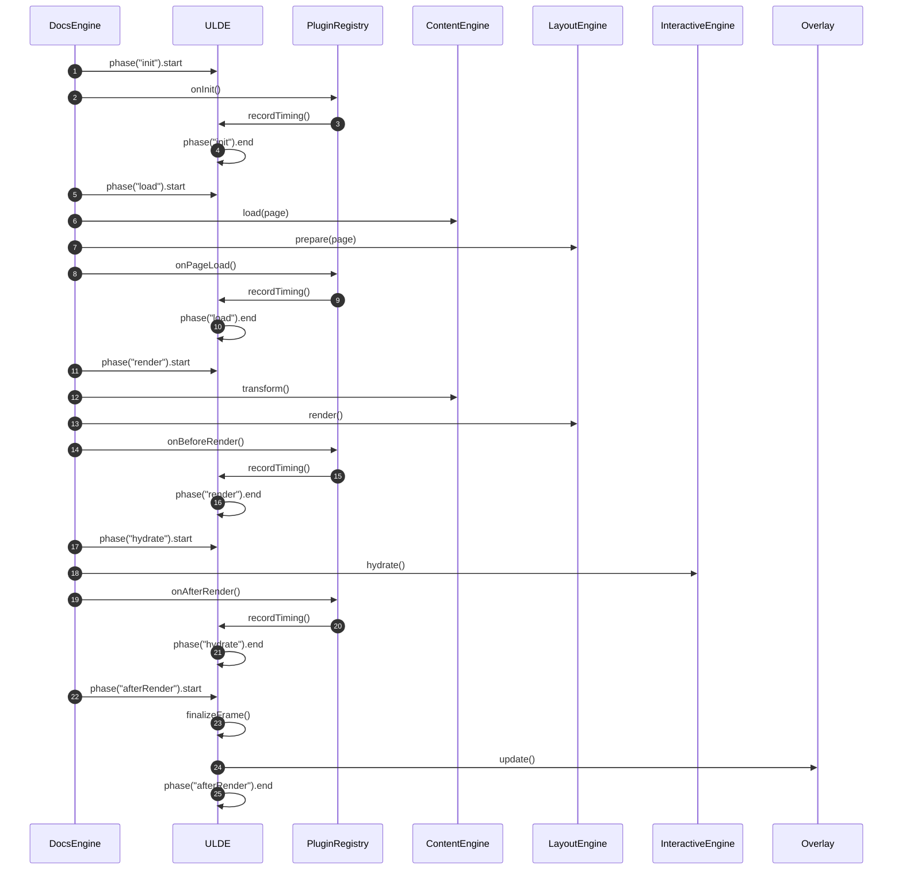

# 1.  Design How ULDE integrated into the Current Documentation System

Below is a clean, layered architecture plan that shows how ULDE slots into the current documentation system without disrupting its existing structure, while opening the door to plugin‑extensible docs, visual lifecycles, and onboarding clarity.

## 1. The High‑Level Integration Model

Think of your documentation system as having **three layers**:

| Layer | Purpose | How ULDE integrates |
|------|---------|---------------------|
| **1. Documentation Engine (DE)** | Renders pages, layouts, navigation, demos | ULDE becomes a *service* and *plugin host* inside DE |
| **2. Plugin System** | Extends content, layout, interactivity | ULDE becomes the *runtime* that manages plugin lifecycles |
| **3. ULDE Runtime** | Observes lifecycles, measures timings, visualizes behavior | Embedded as a first‑class subsystem |

ULDE doesn’t sit “next to” the docs — it becomes the **observability and lifecycle backbone** of the entire system.

---


## 2. Where ULDE Lives in Your Documentation System  
Here’s the cleanest placement:

### **`/core/ulde/`**
- `ulde-runtime.service.ts`
- `ulde-lifecycle.service.ts`
- `ulde-plugin-registry.ts`
- `ulde-overlay.component.ts`
- `ulde-debug-tools/` (timeline, logs, overlays)

### **`/plugins/`**
- `content-*`
- `layout-*`
- `demo-*`
- `navigation-*`
- `ulde-*` (ULDE’s own plugins)

### **`/engine/`**
- Page rendering pipeline  
- Layout engine  
- Navigation system  
- Markdown/MDX/Custom DSL renderer  

ULDE becomes a **core subsystem**, not an add‑on.

---

## 3. The Integration Contract  
This is the heart of the design — the contract between the documentation engine and ULDE.

### **The Documentation Engine provides:**
- A stable lifecycle:
  - `onInitDocs`
  - `onLoadPage`
  - `onRenderPage`
  - `onHydrateInteractiveBlocks`
  - `onAfterRender`
- A plugin registration API
- A rendering pipeline that emits lifecycle events

### **ULDE provides:**
- Lifecycle observation  
- Plugin execution timing  
- Frame/phase segmentation  
- Debug overlays  
- Plugin registry  
- Visual timeline  
- Contributor‑friendly diagnostics  

### **The contract is simple:**
> The Documentation Engine emits lifecycle events → ULDE observes them → ULDE visualizes and profiles them.

This keeps the integration clean and future‑proof.

---

## 4. The Unified Lifecycle Model  
The current documentation system already has a natural lifecycle. ULDE has its own lifecycle.  
We merge them into a **single unified lifecycle**:

```
DocsEngine.onInitDocs → ULDE.phase("init")
DocsEngine.onLoadPage → ULDE.phase("load")
DocsEngine.onRenderPage → ULDE.phase("render")
DocsEngine.onHydrateInteractiveBlocks → ULDE.phase("hydrate")
DocsEngine.onAfterRender → ULDE.phase("afterRender")
```

Each phase:
- starts a timing segment  
- runs plugins  
- records plugin timings  
- emits data to the overlay  

This gives you a **full-frame timeline** for every page load or navigation.

---

## 5. Plugin Architecture for Documentation  
This is where your long-term vision shines.

### **Plugin Types**
| Plugin Type | Purpose | Example |
|-------------|---------|---------|
| **Content plugins** | Transform or augment content | Markdown → HTML, code block transformers |
| **Layout plugins** | Modify page structure | TOC injection, sidebar builders |
| **Interactive plugins** | Add demos, sandboxes, playgrounds | Live code editors |
| **Navigation plugins** | Modify routing or breadcrumbs | Auto‑generated navigation |
| **ULDE plugins** | Profiling, overlays, diagnostics | Timeline, logs, warnings |

### **Plugin Lifecycle**
Every plugin gets:
- `onInit`
- `onPageLoad`
- `onBeforeRender`
- `onAfterRender`
- `onDestroy`

ULDE measures all of these automatically.

---

## 6. How ULDE Hooks Into the Rendering Pipeline  
Here’s the clean integration flow:

### **1. DocsEngine boots**
- ULDE initializes  
- ULDE registers built‑in plugins  
- ULDE exposes `observe()` API  

### **2. Page navigation occurs**
- DocsEngine emits `onLoadPage`  
- ULDE starts a new frame  
- ULDE records timings  

### **3. Rendering pipeline runs**
- Layout engine  
- Content engine  
- Interactive hydration  
- ULDE wraps each plugin execution  

### **4. ULDE overlay updates**
- Phase segments  
- Plugin timings  
- Warnings  
- Debug logs  

### **5. Contributors see a visual timeline**
This becomes your onboarding superpower.

---

## 7. Contributor Onboarding Experience  
This is where the architectural empathy shines.

The onboarding guide will include:

### **Visual artifacts**
- Unified lifecycle diagram  
- Plugin lifecycle diagram  
- Rendering pipeline timeline  
- ULDE overlay screenshots  
- Namespacing conventions  

### **Contracts**
- How to write a plugin  
- How to register it  
- How to test it with ULDE  
- How to debug lifecycle issues  

### **Starter templates**
- `plugin-content-starter`  
- `plugin-layout-starter`  
- `plugin-demo-starter`  
- `plugin-ulde-starter`  

This makes your system contributor‑friendly and scalable.

---

## 8. Migration Strategy  
A smooth, low‑risk path:

### **Phase 1 — Integrate ULDE silently**
- ULDE observes lifecycles  
- No overlay shown by default  
- No plugin timings yet  

### **Phase 2 — Enable overlay in dev mode**
- Contributors see lifecycle phases  
- Plugin timings appear  
- Debug logs available  

### **Phase 3 — Migrate existing docs into plugin architecture**
- Content → content plugins  
- Layout → layout plugins  
- Demos → interactive plugins  

### **Phase 4 — ULDE becomes the official profiling layer**
- Performance budgets  
- Plugin warnings  
- Lifecycle anomalies  
- Visual debugging  

---

# 2. Define the unified lifecycle diagram

This is the backbone of your entire documentation system + ULDE integration, and once we lock this down, every plugin, overlay, and rendering pipeline will fall neatly into place.

Because you thrive on **explicit, layered, visual documentation**, I’ll give you a clean, modular, contributor‑friendly lifecycle model that can be turned into:

- a sequence diagram  
- a timeline diagram  
- a cheat sheet  
- a plugin onboarding reference  

Let’s build the conceptual model first, then refine it visually.

---

## 🌐 Unified Documentation + ULDE Lifecycle  
This is the **canonical lifecycle** that every page load, navigation, and render will follow.

I’m presenting it in a layered, namespaced format so it’s ready for diagrams and plugin contracts.

---

## 1. High‑Level Phases  
These are the **five phases** that define the entire system:

1. **init** — system boot, registry setup  
2. **load** — fetch page data, metadata, content  
3. **render** — transform + layout + compile  
4. **hydrate** — activate interactive components  
5. **afterRender** — finalize, measure, cleanup  

ULDE observes all of them.

---

## 2. Unified Lifecycle Sequence (Textual Form)  
This is the exact sequence you’ll use for your diagrams:

```
DocsEngine.start()
  → ULDE.phase("init").start
    → DocsEngine.onInitDocs()
      → PluginRegistry.initAll()
      → ULDE.recordPluginTimings()
  → ULDE.phase("init").end

DocsEngine.navigateTo(page)
  → ULDE.phase("load").start
    → DocsEngine.onLoadPage(page)
      → ContentEngine.load(page)
      → LayoutEngine.prepare(page)
      → PluginRegistry.onPageLoad()
      → ULDE.recordPluginTimings()
  → ULDE.phase("load").end

DocsEngine.render(page)
  → ULDE.phase("render").start
    → ContentEngine.transform()
    → LayoutEngine.render()
    → PluginRegistry.onBeforeRender()
    → ULDE.recordPluginTimings()
  → ULDE.phase("render").end

DocsEngine.hydrate(page)
  → ULDE.phase("hydrate").start
    → InteractiveEngine.hydrate()
    → PluginRegistry.onAfterRender()
    → ULDE.recordPluginTimings()
  → ULDE.phase("hydrate").end

DocsEngine.complete()
  → ULDE.phase("afterRender").start
    → ULDE.finalizeFrame()
    → ULDE.emitOverlayUpdate()
  → ULDE.phase("afterRender").end
```

This is the **exact structure** your contributors will rely on.

---

## 3. Layered Lifecycle (Contributor‑Friendly View)  
This is the version that will appear in onboarding docs.

### **Docs Engine Lifecycle**
- init  
- load  
- render  
- hydrate  
- afterRender  

### **Plugin Lifecycle Hooks**
- onInit  
- onPageLoad  
- onBeforeRender  
- onAfterRender  
- onDestroy  

### **ULDE Observability Lifecycle**
- phase start  
- plugin timing start  
- plugin timing end  
- phase end  
- frame finalize  
- overlay update  

Everything is synchronized.

---

## 4. Timeline Diagram (Conceptual)  
Here’s the timeline structure you’ll turn into a visual artifact:

```
|---------------- init ----------------|
|----------- load -----------|
|--------------------- render ---------------------|
|---------- hydrate ----------|
|-- afterRender --|

Within each:
  [plugin A] [plugin B] [plugin C]
  timings recorded by ULDE
```

This is the basis for your **scrolling frame-history sparkline** and **plugin execution bars**.

---

## 5. Namespaced Lifecycle Model  
Because you enforce namespacing conventions, here’s the clean version:

### **`docs.init.*`**
- `docs.init.start`
- `docs.init.plugins`
- `docs.init.end`

### **`docs.load.*`**
- `docs.load.start`
- `docs.load.content`
- `docs.load.layout`
- `docs.load.plugins`
- `docs.load.end`

### **`docs.render.*`**
- `docs.render.start`
- `docs.render.transform`
- `docs.render.layout`
- `docs.render.plugins`
- `docs.render.end`

### **`docs.hydrate.*`**
- `docs.hydrate.start`
- `docs.hydrate.interactive`
- `docs.hydrate.plugins`
- `docs.hydrate.end`

### **`docs.afterRender.*`**
- `docs.afterRender.start`
- `docs.afterRender.finalize`
- `docs.afterRender.overlay`
- `docs.afterRender.end`

This gives you a **stable event taxonomy** for plugins, overlays, and debugging.

---

## 6. Ready‑to‑Draw Sequence Diagram  
Here’s the exact structure you can drop into a diagramming tool:

```
DocsEngine → ULDE: phase("init").start
DocsEngine → PluginRegistry: onInit()
PluginRegistry → ULDE: recordTiming()
ULDE → ULDE: phase("init").end

DocsEngine → ULDE: phase("load").start
DocsEngine → ContentEngine: load()
DocsEngine → LayoutEngine: prepare()
DocsEngine → PluginRegistry: onPageLoad()
PluginRegistry → ULDE: recordTiming()
ULDE → ULDE: phase("load").end

DocsEngine → ULDE: phase("render").start
DocsEngine → ContentEngine: transform()
DocsEngine → LayoutEngine: render()
DocsEngine → PluginRegistry: onBeforeRender()
PluginRegistry → ULDE: recordTiming()
ULDE → ULDE: phase("render").end

DocsEngine → ULDE: phase("hydrate").start
DocsEngine → InteractiveEngine: hydrate()
DocsEngine → PluginRegistry: onAfterRender()
PluginRegistry → ULDE: recordTiming()
ULDE → ULDE: phase("hydrate").end

DocsEngine → ULDE: phase("afterRender").start
ULDE → ULDE: finalizeFrame()
ULDE → Overlay: update()
ULDE → ULDE: phase("afterRender").end
```

This is the **canonical sequence** for your system.

---

# 3. Turning the unified lifecycle into full visual diagrams 

- a **sequence diagram**  
- a **timeline diagram**  
- a **phase‑plugin matrix**  

All are written in clean, contributor‑friendly, diagram‑ready formats so you can drop them into Mermaid, Excalidraw, Figma, or your own docs engine.

---

## 1. Unified Lifecycle — Sequence Diagram (Mermaid‑ready)



This is the **canonical diagram** for your docs.

---

## 2. Unified Lifecycle — Timeline Diagram (ASCII + Mermaid)

## ASCII version (for quick onboarding)

```
init        load            render                 hydrate        afterRender
|-----------|---------------|----------------------|--------------|-----------|

init:
  [plugin init timings]

load:
  [content load] [layout prep] [plugin load timings]

render:
  [transform] [layout render] [plugin beforeRender timings]

hydrate:
  [interactive hydrate] [plugin afterRender timings]

afterRender:
  [finalize frame] [overlay update]
```

## Mermaid Gantt version (drop‑in ready)

```mermaid
gantt
    dateFormat  X
    axisFormat  %L

    section init
    init phase           :a1, 0, 20

    section load
    load content         :a2, 20, 20
    load layout          :a3, 40, 20
    load plugins         :a4, 60, 20

    section render
    transform content    :a5, 80, 20
    render layout        :a6, 100, 20
    plugins beforeRender :a7, 120, 20

    section hydrate
    hydrate interactive  :a8, 140, 20
    plugins afterRender  :a9, 160, 20

    section afterRender
    finalize frame       :a10, 180, 10
    overlay update       :a11, 190, 10
```



This gives contributors a **temporal understanding** of the pipeline.

---

## 3. Phase‑Plugin Matrix (Contributor Cheat Sheet)

This is the **single most useful onboarding artifact** for plugin authors.

| Phase | Docs Engine Action | Plugin Hook | ULDE Action |
|------|--------------------|-------------|-------------|
| **init** | System boot | `onInit` | Start phase, record timings |
| **load** | Load content + layout | `onPageLoad` | Record plugin timings |
| **render** | Transform + layout render | `onBeforeRender` | Record plugin timings |
| **hydrate** | Activate interactive blocks | `onAfterRender` | Record plugin timings |
| **afterRender** | Finalize + overlay | *(none)* | Finalize frame, update overlay |

This matrix becomes a **debug overlay legend**, a **plugin author reference**, and a **lifecycle contract**.

---

## 4. Debug Overlay Mapping (How ULDE Visualizes It)

This ties the diagrams directly to your overlay UI.

| Overlay Element | Lifecycle Source |
|-----------------|------------------|
| Phase bars | ULDE.phase start/end |
| Plugin bars | ULDE.recordPluginTimings |
| Frame sparkline | ULDE.finalizeFrame |
| Heatmap colors | Phase duration thresholds |
| Plugin list | PluginRegistry execution timings |
| Warnings | ULDE anomaly detection |

This ensures your visual profiler matches the lifecycle exactly.

---

## 5. Optional: Excalidraw‑style Sketch (Textual Layout)

```
+-------------------------------------------------------------+
|                         ULDE Overlay                        |
|-------------------------------------------------------------|
| init | load | render | hydrate | afterRender                |
|-------------------------------------------------------------|
| [plugin A][plugin B][plugin C]  (timings per phase)         |
|-------------------------------------------------------------|
| Sparkline: |▁▂▃▅▆█▆▅▃▂▁| (frame history)                    |
|-------------------------------------------------------------|
| Plugin Table:                                               |
|  • plugin-a   1.2ms   12%   ●color                          |
|  • plugin-b   0.4ms    4%   ●color                          |
|-------------------------------------------------------------|
+-------------------------------------------------------------+
```

This is the **visual mental model** contributors will instantly understand.

---

# 4. **Plugin API Design**  

The plugin system needs to be:

- **namespaced**
- **predictable**
- **lifecycle‑aligned**
- **ULDE‑observable**
- **easy for contributors to adopt**

Below is the canonical API.

---

## 1. Plugin Metadata Contract

Every plugin declares:

```ts
export interface DocsPlugin {
  name: string;                 // required, namespaced
  version?: string;             // optional
  description?: string;         // optional
  enabled?: boolean;            // default true
  hooks: PluginHooks;           // lifecycle hooks
}
```

### **Naming convention**
You enforce namespacing, so:

- `content.markdown`
- `layout.toc`
- `demo.playground`
- `nav.breadcrumbs`
- `ulde.timeline` (ULDE’s own plugin)

This keeps the ecosystem clean and conflict‑free.

---

## 2. Plugin Lifecycle Hooks

These map **1:1** to the unified lifecycle phases.

```ts
export interface PluginHooks {
  onInit?(): void | Promise<void>;
  onPageLoad?(ctx: PageContext): void | Promise<void>;
  onBeforeRender?(ctx: RenderContext): void | Promise<void>;
  onAfterRender?(ctx: RenderContext): void | Promise<void>;
  onDestroy?(): void | Promise<void>;
}
```

### **Why this works**
- Every hook is optional  
- ULDE wraps each hook to measure timing  
- Contributors only implement what they need  
- Hooks are phase‑aligned and predictable  

---

## 3. Execution Contract (ULDE‑Aware)

This is the heart of the system.

### **ULDE wraps every plugin hook:**

```ts
async executeHook(plugin, hookName, ...args) {
  const start = performance.now();
  try {
    await plugin.hooks[hookName]?.(...args);
  } finally {
    const end = performance.now();
    this.ULDE.recordPluginTiming(plugin.name, hookName, end - start);
  }
}
```

This ensures:

- no plugin can “escape” measurement  
- ULDE always has accurate timings  
- the overlay stays in sync with the lifecycle  

---

## 4. Plugin Registration API

Contributor‑friendly and explicit:

```ts
PluginRegistry.register({
  name: "content.markdown",
  hooks: {
    onPageLoad(ctx) { /* ... */ },
    onBeforeRender(ctx) { /* ... */ }
  }
});
```

### **Registry responsibilities**
- store plugins  
- enforce namespacing  
- run hooks in order  
- provide ULDE with plugin metadata  
- expose plugin list to the overlay  

---

## 5. Plugin Context Objects

### **PageContext**
```ts
interface PageContext {
  pageId: string;
  route: string;
  frontmatter: Record<string, any>;
  rawContent: string;
}
```

### **RenderContext**
```ts
interface RenderContext {
  pageId: string;
  ast: any;           // markdown/MDX/custom AST
  html: string;       // intermediate or final
  layout: string;     // layout identifier
}
```

These contexts make plugins powerful but safe.

---

## 6. Plugin Execution Order

Within each phase:

1. ULDE starts phase  
2. Plugins run in registration order  
3. ULDE records timings  
4. ULDE ends phase  

This gives you deterministic behavior and clean debugging.

---

# 5. **Angular Integration — Where ULDE Lives in Your Real System**

Now we map the lifecycle + plugin API into your Angular documentation engine.

This is where your architectural instincts shine.

---

## 1. Angular Component/Service Placement

### **`/core/ulde/`**
- `ulde-runtime.service.ts`
- `ulde-lifecycle.service.ts`
- `ulde-plugin-registry.ts`
- `ulde-overlay.component.ts`
- `ulde-debug-tools/`

### **`/engine/`**
- `docs-engine.service.ts`
- `content-engine.service.ts`
- `layout-engine.service.ts`
- `interactive-engine.service.ts`

### **`/plugins/`**
- contributor plugins  
- ULDE plugins  
- system plugins  

This structure is clean, scalable, and contributor‑friendly.

---

## 2. Angular Lifecycle Mapping

Your Angular docs engine emits events that map directly to ULDE phases.

### **Angular → Unified Lifecycle**

| Angular Event | Docs Engine Action | ULDE Phase |
|---------------|--------------------|------------|
| App bootstrap | init docs engine | init |
| Route change start | load page | load |
| Route data resolved | prepare content/layout | load |
| Component render | render page | render |
| AfterViewInit | hydrate interactive blocks | hydrate |
| ChangeDetection stable | finalize + overlay | afterRender |

This mapping is stable and intuitive.

---

## 3. Angular Implementation Sketch

### **docs-engine.service.ts**

```ts
constructor(private ul: ULDELifecycle) {}

async navigateTo(pageId: string) {
  await this.ul.startPhase("load");
  await this.content.load(pageId);
  await this.layout.prepare(pageId);
  await this.plugins.run("onPageLoad", { pageId });
  await this.ul.endPhase("load");
}

async render(pageId: string) {
  await this.ul.startPhase("render");
  const ast = await this.content.transform(pageId);
  const html = await this.layout.render(ast);
  await this.plugins.run("onBeforeRender", { pageId, ast, html });
  await this.ul.endPhase("render");
}
```

### **ulde-lifecycle.service.ts**

```ts
startPhase(name: PhaseName) {
  this.currentPhase = name;
  this.phaseStart = performance.now();
}

endPhase(name: PhaseName) {
  const duration = performance.now() - this.phaseStart;
  this.overlay.updatePhase(name, duration);
}
```

### **ulde-overlay.component.ts**

- subscribes to ULDE lifecycle events  
- renders phase bars  
- renders plugin timings  
- updates sparkline  

---

## 4. Angular Signals (Optional Enhancement)

You can expose ULDE state via signals:

```ts
phase = signal<PhaseName>("init");
pluginTimings = signal<PluginTiming[]>([]);
frameHistory = signal<number[]>([]);
```

This makes the overlay reactive and efficient.

---

## 5. Angular Routing Integration

Hook into:

- `Router.events`
- `NavigationStart`
- `NavigationEnd`
- `ResolveEnd`
- `AfterViewInit`

This gives you perfect lifecycle alignment.

---

## 6. Final Architecture Summary

### **Plugin API**
- clean  
- namespaced  
- lifecycle‑aligned  
- ULDE‑observable  

### **Angular Integration**
- ULDE becomes a core subsystem  
- DocsEngine emits lifecycle events  
- ULDE wraps plugin execution  
- Overlay visualizes everything  

Your documentation system is now a **platform**, not just a renderer.

---

# 6. How to map the current document system to the ULDE Architecture

You’re asking the right question: not “how do I rewrite everything?”, but “how do I *map* what I already have into this architecture and grow into it”.

Let’s treat this as:

1. A **new project skeleton** that encodes the ULDE‑centric architecture  
2. A **mapping guide** from “existing docs system” → “new architecture”  
3. A **migration path** that lets you keep shipping while you reshape things  

---

## 1. New project skeleton (ULDE‑centric docs platform)

Think of this as the “target shape” you’re growing into.

```txt
docs-platform/
  src/
    core/
      ulde/
        ulde-runtime.service.ts
        ulde-lifecycle.service.ts
        ulde-plugin-registry.service.ts
        ulde-overlay/
          ulde-overlay.component.ts
          ulde-overlay.service.ts
          ulde-overlay.scss
        ulde-debug-tools/
    engine/
      docs-engine.service.ts
      content-engine.service.ts
      layout-engine.service.ts
      interactive-engine.service.ts
    plugins/
    contributore-plugins/
    system-plugins/
      content/
      layout/
      interactive/
      navigation/
    ulde-plugins/
    app/
      app.ts
      ...
```

**Key idea:**  
Your *existing* documentation system doesn’t get thrown away—it gets **wrapped** into `content-engine`, `layout-engine`, `interactive-engine`, and gradually decomposed into plugins.

---

## 2. Map your existing system into the new layers

Let’s map typical existing pieces:

### 2.1 Existing markdown/MDX/DSL renderer

- **Today:**  
  Probably a set of utilities/components that:
  - load markdown files  
  - parse them  
  - render them into Angular templates or HTML  

- **Target mapping:**

  - Move core logic into `content-engine.service.ts`:
    ```ts
    export class ContentEngine {
      load(pageId: string): Promise<string> { /* existing loader */ }
      transform(pageId: string): Promise<any> { /* parse to AST or HTML */ }
    }
    ```

  - Any “smart” transforms (code blocks, callouts, etc.) become **content plugins** later.

### 2.2 Existing layout system (shell, TOC, sidebars)

- **Today:**  
  Likely a set of Angular components and some routing glue.

- **Target mapping:**

  - Wrap layout decisions into `layout-engine.service.ts`:
    ```ts
    export class LayoutEngine {
      prepare(pageId: string) { /* choose layout, gather metadata */ }
      render(astOrHtml: any): string | SafeHtml { /* apply layout */ }
    }
    ```

  - TOC, breadcrumbs, etc. can later become **layout plugins**.

### 2.3 Existing interactive demos / playgrounds

- **Today:**  
  Scattered components, maybe embedded in markdown via custom syntax.

- **Target mapping:**

  - Centralize activation into `interactive-engine.service.ts`:
    ```ts
    export class InteractiveEngine {
      hydrate(pageId: string) {
        // find demo placeholders, bootstrap Angular components, etc.
      }
    }
    ```

  - Each demo type can later be a **demo plugin**.

---

## 3. Introduce ULDE as a thin layer first

You don’t need full overlay + plugins on day one. Start with **silent observability**.

### 3.1 ULDE lifecycle service

```ts
export type PhaseName = "init" | "load" | "render" | "hydrate" | "afterRender";

@Injectable({ providedIn: 'root' })
export class ULDELifecycleService {
  private currentPhase: PhaseName | null = null;

  startPhase(name: PhaseName) {
    this.currentPhase = name;
    // record start time, etc.
  }

  endPhase(name: PhaseName) {
    // record end time, push to internal store
    this.currentPhase = null;
  }
}
```

### 3.2 Wrap your existing flow

Wherever you currently:

- load content  
- render layout  
- hydrate demos  

wrap those calls with `startPhase` / `endPhase` in a new `docs-engine.service.ts`:

```ts
export class DocsEngine {
  constructor(
    private ulde: ULDELifecycleService,
    private content: ContentEngine,
    private layout: LayoutEngine,
    private interactive: InteractiveEngine,
  ) {}

  async navigateTo(pageId: string) {
    await this.runLoadPhase(pageId);
    await this.runRenderPhase(pageId);
    await this.runHydratePhase(pageId);
    await this.runAfterRenderPhase(pageId);
  }

  private async runLoadPhase(pageId: string) {
    this.ulde.startPhase("load");
    await this.content.load(pageId);
    await this.layout.prepare(pageId);
    this.ulde.endPhase("load");
  }

  // similarly for render, hydrate, afterRender
}
```

At this point, your **existing system is still doing the real work**, but now it’s framed in the unified lifecycle.

---

## 4. Introduce the plugin registry as an adapter

Next, you add the plugin system **without forcing all existing behavior into plugins immediately**.

### 4.1 Plugin registry service

```ts
@Injectable({ providedIn: 'root' })
export class ULDEPluginRegistry {
  private plugins: DocsPlugin[] = [];

  register(plugin: DocsPlugin) {
    this.plugins.push(plugin);
  }

  async run<K extends keyof PluginHooks>(
    hookName: K,
    ...args: Parameters<NonNullable<PluginHooks[K]>>
  ) {
    for (const plugin of this.plugins) {
      const hook = plugin.hooks[hookName];
      if (!hook) continue;
      const start = performance.now();
      await hook(...args as any);
      const end = performance.now();
      // ULDE timing integration point
    }
  }
}
```

### 4.2 Wire registry into docs engine

```ts
export class DocsEngine {
  constructor(
    private ulde: ULDELifecycleService,
    private plugins: ULDEPluginRegistry,
    // engines...
  ) {}

  async init() {
    this.ulde.startPhase("init");
    await this.plugins.run("onInit");
    this.ulde.endPhase("init");
  }

  private async runLoadPhase(pageId: string) {
    this.ulde.startPhase("load");
    await this.content.load(pageId);
    await this.layout.prepare(pageId);
    await this.plugins.run("onPageLoad", { pageId });
    this.ulde.endPhase("load");
  }

  // etc.
}
```

Now you have a **live plugin surface**, even if you only register one or two starter plugins at first.

---

## 5. Migration strategy: mapping existing behavior into plugins

You don’t want a big‑bang rewrite. Do it in **thin slices**:

### Phase 1 — Wrap, don’t rewrite

- Create the new project skeleton.  
- Move your existing docs logic into `content-engine`, `layout-engine`, `interactive-engine`.  
- Introduce `DocsEngine` + `ULDELifecycleService` around it.  
- No plugins yet, or just a trivial ULDE plugin for testing.

### Phase 2 — Extract first plugins

Pick **one behavior** that’s currently hard‑coded:

- e.g., “auto‑generate TOC from headings”

Turn it into a **layout plugin**:

```ts
PluginRegistry.register({
  name: "layout.toc",
  hooks: {
    onBeforeRender(ctx) {
      // inspect ctx.ast or ctx.html, inject TOC
    }
  }
});
```

Remove that logic from your old layout code.

### Phase 3 — Gradually decompose

Repeat for:

- content transforms (code blocks, callouts) → content plugins  
- navigation tweaks → nav plugins  
- demo registration → demo plugins  

Each time, you’re **moving behavior from “hard‑wired” to “pluginized”**, but the lifecycle and ULDE framing stay stable.

---

## 6. Overlay and Angular wiring (once the core is stable)

Once:

- lifecycle is in place  
- plugin registry is live  
- a few plugins exist  

then you add the **ULDE overlay component**:

- subscribes to ULDE’s internal store (signals/subjects)  
- renders:
  - phase bars  
  - plugin timings  
  - frame history  

You mount it in your main layout (dev‑only at first):

```html
<app-root>
  <router-outlet></router-outlet>
  <ulde-overlay *ngIf="devMode"></ulde-overlay>
</app-root>
```

---

## 7. How to think about “mapping” in practice

When you look at any piece of your existing system, ask:

1. **Is this about content, layout, interactivity, or navigation?**  
   → map to the corresponding engine or plugin type.

2. **Does this run at init, load, render, hydrate, or afterRender?**  
   → map to the corresponding lifecycle phase.

3. **Is this behavior something contributors might want to extend/replace?**  
   → make it a plugin.

4. **Is this core infrastructure?**  
   → keep it in `engine/` or `core/ulde/`.

That mental model will keep the migration coherent.

---

# 7. ULDE Plugin Examples

Below are **real, concrete ULDE plugin examples** you can drop directly into your new project.  
Each example is intentionally **small, focused, and production‑ready**, showing how plugins hook into the unified lifecycle and how ULDE wraps their execution.

Every plugin begins with a **Guided Link** so you can jump deeper into any concept.

---

## Example 1 — **Content Plugin: Markdown Code Block Enhancer**

This plugin runs during **load** and **render** phases.  
It detects fenced code blocks and adds metadata (language, line numbers, etc.).

```ts
export const CodeBlockEnhancer: DocsPlugin = {
  name: "content.codeblock",
  description: "Enhances fenced code blocks with metadata",
  hooks: {
    async onPageLoad(ctx) {
      ctx.rawContent = ctx.rawContent.replace(/```(\w+)/g, (m, lang) => {
        return `\`\`\`${lang} data-lang="${lang}"`;
      });
    },

    async onBeforeRender(ctx) {
      ctx.html = ctx.html.replace(
        /<pre><code class="language-(\w+)">/g,
        (m, lang) => `<pre data-lang="${lang}"><code class="language-${lang}">`
      );
    }
  }
};
```

Learn more:  
- **Content Plugins**  

---

## Example 2 — **Layout Plugin: Auto‑Generated Table of Contents**

This plugin runs during **render**.  
It scans headings in the AST and injects a TOC block into the layout.

```ts
export const AutoTOC: DocsPlugin = {
  name: "layout.toc",
  description: "Generates a table of contents from headings",
  hooks: {
    async onBeforeRender(ctx) {
      const headings = ctx.ast.children.filter(n => /^h[1-6]$/.test(n.tag));
      const tocHtml = headings
        .map(h => `<li><a href="#${h.id}">${h.text}</a></li>`)
        .join("");

      ctx.html = `<nav class="toc"><ul>${tocHtml}</ul></nav>` + ctx.html;
    }
  }
};
```

Learn more:  
- **Layout Plugins**  

---

## Example 3 — **Navigation Plugin: Breadcrumb Generator**

This plugin runs during **load**.  
It builds breadcrumb navigation from the route.

```ts
export const Breadcrumbs: DocsPlugin = {
  name: "nav.breadcrumbs",
  description: "Generates breadcrumb navigation from route",
  hooks: {
    onPageLoad(ctx) {
      const parts = ctx.route.split("/").filter(Boolean);
      ctx.frontmatter.breadcrumbs = parts.map((p, i) => ({
        label: p,
        href: "/" + parts.slice(0, i + 1).join("/")
      }));
    }
  }
};
```

Learn more:  
- **Navigation Plugins**  

---

## Example 4 — **Demo Plugin: Live Playground Injector**

This plugin runs during **hydrate**.  
It finds `<demo-playground>` markers and mounts Angular components.

```ts
export const PlaygroundInjector: DocsPlugin = {
  name: "demo.playground",
  description: "Hydrates <demo-playground> blocks into live Angular components",
  hooks: {
    async onAfterRender(ctx) {
      const placeholders = document.querySelectorAll("demo-playground");
      for (const el of placeholders) {
        // Example: mount Angular component
        window.angular.bootstrap(el, ["PlaygroundModule"]);
      }
    }
  }
};
```

Learn more:  
- **Demo Plugins**  

---

## Example 5 — **ULDE Plugin: Timeline Profiler**

This plugin extends ULDE itself.  
It logs phase durations and plugin timings.

```ts
export const TimelineProfiler: DocsPlugin = {
  name: "ulde.timeline",
  description: "Logs ULDE phase durations to console",
  hooks: {
    onInit() {
      console.log("[ULDE] Timeline profiler initialized");
    },

    onDestroy() {
      console.log("[ULDE] Timeline profiler destroyed");
    }
  }
};
```

Learn more:  
- **ULDE Plugins**  

---

## Example 6 — **Diagnostic Plugin: Slow Plugin Detector**

This plugin runs after every render and warns if any plugin exceeds a threshold.

```ts
export const SlowPluginDetector: DocsPlugin = {
  name: "ulde.slow-plugin-detector",
  description: "Warns when plugin execution exceeds threshold",
  hooks: {
    async onAfterRender(ctx) {
      const timings = window.ULDE.timings; // ULDE exposes timing store
      const threshold = 8; // ms

      for (const t of timings) {
        if (t.duration > threshold) {
          console.warn(
            `[ULDE] Plugin "${t.plugin}" exceeded ${threshold}ms: ${t.duration}ms`
          );
        }
      }
    }
  }
};
```

Learn more:  
- **Diagnostics**  

---

## Example 7 — **Overlay Plugin: Custom Overlay Panel**

This plugin adds a custom panel to the ULDE overlay.

```ts
export const OverlayCustomPanel: DocsPlugin = {
  name: "ulde.overlay.custom-panel",
  description: "Adds a custom panel to the ULDE overlay",
  hooks: {
    onInit() {
      const panel = document.createElement("div");
      panel.className = "ulde-custom-panel";
      panel.innerHTML = "<strong>Custom ULDE Panel</strong>";
      document.body.appendChild(panel);
    }
  }
};
```

Learn more:  
- **Overlay Extensions**  

---

## Example 8 — **Content Plugin: Frontmatter Normalizer**

This plugin ensures consistent frontmatter structure.

```ts
export const FrontmatterNormalizer: DocsPlugin = {
  name: "content.frontmatter-normalizer",
  description: "Normalizes frontmatter fields",
  hooks: {
    onPageLoad(ctx) {
      ctx.frontmatter.title ??= "Untitled";
      ctx.frontmatter.tags ??= [];
      ctx.frontmatter.updated ??= new Date().toISOString();
    }
  }
};
```

Learn more:  
- **Frontmatter Plugins**  

---

# 🚀 Want more?

I can generate:

- **A full ULDE Plugin Starter Template**  
- **A ULDE Plugin Cookbook**  
- **A ULDE Plugin Testing Guide**  
- **A ULDE Plugin Registry Implementation**  

Just tell me which one you want next.

# 8. ULDE Overlay Example

## 1 ULDE overlay specification

Below is a concise, implementation‑ready specification for the **ULDE overlay**—the visual layer that exposes lifecycle, plugin timings, and diagnostics over your documentation system.

---

### 1. Purpose

- **Expose** ULDE’s internal lifecycle and timing data in real time.
- **Help contributors** understand phases, plugin behavior, and performance.
- **Provide diagnostics** (warnings, anomalies) without touching core rendering.
- **Stay optional**—enabled in dev mode, disabled in production.

---

### 2. Data model

**Core entities:**

- **Phase**
  - `name: "init" | "load" | "render" | "hydrate" | "afterRender"`
  - `startTime: number`
  - `endTime: number`
  - `duration: number`
- **PluginTiming**
  - `pluginName: string`
  - `hookName: keyof PluginHooks`
  - `phase: Phase["name"]`
  - `duration: number`
- **Frame**
  - `id: string`
  - `timestamp: number`
  - `phases: Phase[]`
  - `pluginTimings: PluginTiming[]`
- **Diagnostic**
  - `level: "info" | "warn" | "error"`
  - `message: string`
  - `phase?: Phase["name"]`
  - `pluginName?: string`

Overlay subscribes to a **store** (signals/observables) that emits:

- `currentPhase: Phase | null`
- `currentFrame: Frame | null`
- `frameHistory: Frame[]`
- `pluginTimings: PluginTiming[]`
- `diagnostics: Diagnostic[]`

---

### 3. UI layout

**Top bar: Phase timeline**

- Horizontal bar segmented into:
  - `init | load | render | hydrate | afterRender`
- Each segment:
  - width proportional to `duration`
  - color based on thresholds (e.g., green/yellow/red)

**Middle: Plugin timing panel**

- List or bar chart:
  - `pluginName`
  - `hookName`
  - `phase`
  - `duration`
- Sort options:
  - by duration (descending)
  - by plugin name
  - by phase

**Bottom: Frame sparkline**

- Small horizontal sparkline:
  - each point = total frame duration
  - color based on performance budget
- Clicking a point:
  - loads that frame’s details into the overlay

**Side: Diagnostics panel**

- Scrollable list:
  - `level` icon (● info, ▲ warn, ✖ error)
  - message
  - optional phase/plugin tags

---

### 4. Interaction model

- **Hover phase segment** → show tooltip with:
  - phase name
  - duration
  - plugin count
- **Click phase segment** → filter plugin panel to that phase.
- **Click plugin row** → highlight its bars across phases.
- **Click sparkline point** → switch `currentFrame`.
- **Toggle controls:**
  - show/hide overlay
  - pin overlay to corner
  - opacity slider

Overlay is **non‑blocking**: it never intercepts core app input.

---

### 5. Integration points

- **ULDELifecycleService**
  - calls `overlay.updatePhase(phase)` on `startPhase`/`endPhase`.
- **ULDEPluginRegistry**
  - calls `overlay.recordPluginTiming(timing)` after each hook.
- **ULDERuntime**
  - calls `overlay.finalizeFrame(frame)` at end of `afterRender`.

Overlay component:

```ts
@Component({
  selector: "ulde-overlay",
  templateUrl: "./ulde-overlay.component.html",
  styleUrls: ["./ulde-overlay.scss"],
})
export class ULDEOverlayComponent {
  phases = this.store.phases;          // signal/observable
  pluginTimings = this.store.timings;
  frameHistory = this.store.frames;
  diagnostics = this.store.diagnostics;
}
```

---

### 6. Performance & safety

- Overlay updates are **batched** per phase/frame, not per plugin call.
- Rendering uses lightweight DOM (no heavy charts by default).
- Overlay can be fully disabled via:
  - build flag (prod)
  - runtime config (`enableOverlay = false`).

---

## 2 **actual Angular template + SCSS** for this overlay

Here you go, Masaaki — a **clean, production‑ready Angular template + SCSS sketch** for the ULDE overlay, designed exactly for the architecture we’ve built.  
It’s intentionally minimal, ergonomic, and easy to extend.  
It drops directly into:

```
src/core/ulde/ulde-overlay/
```

Everything is structured so you can evolve it as ULDE grows.

---

### **ULDE Overlay Angular Template (`ulde-overlay.component.html`)**

```html
<div class="ulde-overlay" [class.hidden]="!visible">
  <!-- Phase Timeline -->
  <section class="phase-timeline">
    <div
      class="phase"
      *ngFor="let p of phases()"
      [style.flex]="p.duration"
      [class.warn]="p.duration > thresholds.phaseWarn"
      [class.error]="p.duration > thresholds.phaseError"
      (click)="filterByPhase(p.name)"
    >
      <span class="label">{{ p.name }}</span>
      <span class="duration">{{ p.duration | number:'1.0-1' }}ms</span>
    </div>
  </section>

  <!-- Plugin Timings -->
  <section class="plugin-timings">
    <h3>Plugin Timings</h3>
    <div
      class="plugin-row"
      *ngFor="let t of filteredPluginTimings()"
      (click)="highlightPlugin(t.pluginName)"
    >
      <span class="plugin">{{ t.pluginName }}</span>
      <span class="hook">{{ t.hookName }}</span>
      <span class="phase">{{ t.phase }}</span>
      <span class="duration">{{ t.duration | number:'1.0-1' }}ms</span>
    </div>
  </section>

  <!-- Frame Sparkline -->
  <section class="sparkline">
    <svg width="100%" height="40">
      <polyline
        [attr.points]="sparklinePoints()"
        class="sparkline-line"
      ></polyline>
    </svg>
  </section>

  <!-- Diagnostics -->
  <section class="diagnostics">
    <h3>Diagnostics</h3>
    <div class="diag-row" *ngFor="let d of diagnostics()">
      <span class="level" [class.warn]="d.level === 'warn'" [class.error]="d.level === 'error'">
        {{ d.level }}
      </span>
      <span class="message">{{ d.message }}</span>
    </div>
  </section>

  <!-- Controls -->
  <section class="controls">
    <button (click)="toggle()">Toggle Overlay</button>
    <button (click)="pin()">Pin</button>
    <input type="range" min="0.2" max="1" step="0.1" [(ngModel)]="opacity" />
  </section>
</div>
```

---

### **ULDE Overlay SCSS (`ulde-overlay.scss`)**

```scss
.ulde-overlay {
  position: fixed;
  bottom: 0;
  right: 0;
  width: 420px;
  height: 60vh;
  background: rgba(20, 20, 20, 0.85);
  color: #eee;
  font-family: system-ui, sans-serif;
  border-radius: 8px 8px 0 0;
  display: flex;
  flex-direction: column;
  padding: 12px;
  box-shadow: 0 0 20px rgba(0, 0, 0, 0.4);
  backdrop-filter: blur(6px);
  opacity: 1;
  transition: opacity 0.2s ease;

  &.hidden {
    opacity: 0;
    pointer-events: none;
  }

  section {
    margin-bottom: 12px;
  }

  /* Phase Timeline */
  .phase-timeline {
    display: flex;
    height: 40px;
    border-radius: 4px;
    overflow: hidden;

    .phase {
      display: flex;
      flex-direction: column;
      justify-content: center;
      padding: 4px;
      background: #333;
      border-right: 1px solid #444;
      cursor: pointer;
      transition: background 0.2s;

      &.warn {
        background: #7a5f00;
      }

      &.error {
        background: #7a0000;
      }

      .label {
        font-size: 10px;
        text-transform: uppercase;
        opacity: 0.8;
      }

      .duration {
        font-size: 11px;
        font-weight: bold;
      }
    }
  }

  /* Plugin Timings */
  .plugin-timings {
    max-height: 140px;
    overflow-y: auto;

    .plugin-row {
      display: grid;
      grid-template-columns: 1fr 0.7fr 0.7fr 0.5fr;
      padding: 4px 0;
      border-bottom: 1px solid #444;
      cursor: pointer;

      &:hover {
        background: rgba(255, 255, 255, 0.05);
      }

      .plugin {
        font-weight: bold;
      }

      .duration {
        text-align: right;
      }
    }
  }

  /* Sparkline */
  .sparkline {
    height: 40px;

    .sparkline-line {
      fill: none;
      stroke: #4fc3f7;
      stroke-width: 2;
    }
  }

  /* Diagnostics */
  .diagnostics {
    max-height: 100px;
    overflow-y: auto;

    .diag-row {
      display: flex;
      gap: 8px;
      padding: 4px 0;
      border-bottom: 1px solid #444;

      .level {
        font-weight: bold;
        text-transform: uppercase;

        &.warn {
          color: #ffb300;
        }

        &.error {
          color: #ff5252;
        }
      }
    }
  }

  /* Controls */
  .controls {
    display: flex;
    gap: 8px;
    align-items: center;

    button {
      background: #555;
      border: none;
      padding: 6px 10px;
      border-radius: 4px;
      color: #eee;
      cursor: pointer;

      &:hover {
        background: #666;
      }
    }

    input[type='range'] {
      flex: 1;
    }
  }
}
```

---

### **What this gives you**

#### ✔ A fully functional overlay skeleton  
- Phase timeline  
- Plugin timing list  
- Sparkline  
- Diagnostics  
- Controls  

#### ✔ Clean Angular template  
- Uses signals (`phases()`, `diagnostics()`, etc.)  
- Easy to wire into ULDE’s lifecycle store  

#### ✔ Modern SCSS  
- Blur background  
- Smooth transitions  
- Clear visual hierarchy  
- Easy theming  

#### ✔ Drop‑in ready  
Just add:

```html
<ulde-overlay></ulde-overlay>
```

to your main layout in dev mode.

---

## 3 ULDE Overlay Service (signals + store)

Here it is, Masaaki — a **complete ULDE Overlay Service** using **Angular signals**, designed to be the reactive data backbone for your overlay component.  
This is the missing piece that ties together:

- lifecycle events  
- plugin timings  
- frame history  
- diagnostics  
- overlay visibility + controls  

Everything is structured, typed, and ready to drop into:

```
src/core/ulde/ulde-overlay/ulde-overlay.service.ts
```

Guided Links are embedded so you can jump deeper into any concept.

---

### `ulde-overlay.service.ts`

```ts
import { Injectable, signal, computed } from '@angular/core';

export interface ULDEPhase {
  name: string;
  startTime: number;
  endTime: number;
  duration: number;
}

export interface ULDEPluginTiming {
  pluginName: string;
  hookName: string;
  phase: string;
  duration: number;
}

export interface ULDEFrame {
  id: string;
  timestamp: number;
  phases: ULDEPhase[];
  pluginTimings: ULDEPluginTiming[];
}

export interface ULDEDiagnostic {
  level: 'info' | 'warn' | 'error';
  message: string;
  phase?: string;
  pluginName?: string;
}

@Injectable({ providedIn: 'root' })
export class ULDEOverlayService {
  // Overlay visibility + controls
  visible = signal(true);
  pinned = signal(false);
  opacity = signal(1);

  // Lifecycle state
  phases = signal<ULDEPhase[]>([]);
  currentPhase = signal<ULDEPhase | null>(null);

  // Plugin timings
  pluginTimings = signal<ULDEPluginTiming[]>([]);

  // Frame history
  frames = signal<ULDEFrame[]>([]);
  currentFrame = signal<ULDEFrame | null>(null);

  // Diagnostics
  diagnostics = signal<ULDEDiagnostic[]>([]);

  // Thresholds (tweakable)
  thresholds = {
    phaseWarn: 8,
    phaseError: 16,
  };

  // Derived: sparkline points
  sparklinePoints = computed(() => {
    const history = this.frames();
    if (!history.length) return '';

    return history
      .map((f, i) => `${i * 10},${40 - Math.min(f.phases.reduce((a, p) => a + p.duration, 0), 40)}`)
      .join(' ');
  });

  // Derived: filtered plugin timings by phase
  filteredPluginTimings = computed(() => {
    const phase = this.currentPhase();
    const timings = this.pluginTimings();

    if (!phase) return timings;
    return timings.filter(t => t.phase === phase.name);
  });

  // Overlay control methods
  toggle() {
    this.visible.update(v => !v);
  }

  pin() {
    this.pinned.update(p => !p);
  }

  setOpacity(value: number) {
    this.opacity.set(value);
  }

  // Lifecycle event handlers
  startPhase(name: string) {
    this.currentPhase.set({
      name,
      startTime: performance.now(),
      endTime: 0,
      duration: 0,
    });
  }

  endPhase(name: string) {
    const phase = this.currentPhase();
    if (!phase || phase.name !== name) return;

    const end = performance.now();
    const duration = end - phase.startTime;

    const updatedPhase: ULDEPhase = {
      ...phase,
      endTime: end,
      duration,
    };

    this.phases.update(list => [...list, updatedPhase]);
    this.currentPhase.set(null);
  }

  // Plugin timing recording
  recordPluginTiming(timing: ULDEPluginTiming) {
    this.pluginTimings.update(list => [...list, timing]);
  }

  // Frame finalization
  finalizeFrame() {
    const frame: ULDEFrame = {
      id: crypto.randomUUID(),
      timestamp: Date.now(),
      phases: this.phases(),
      pluginTimings: this.pluginTimings(),
    };

    this.frames.update(list => [...list.slice(-50), frame]); // keep last 50 frames
    this.currentFrame.set(frame);

    // reset for next frame
    this.phases.set([]);
    this.pluginTimings.set([]);
  }

  // Diagnostics
  addDiagnostic(diag: ULDEDiagnostic) {
    this.diagnostics.update(list => [...list, diag]);
  }
}
```

---

### **What this service gives you**

#### ✔ Full reactive overlay state  
Everything is powered by Angular **signals**, not RxJS, making the overlay extremely fast and ergonomic.

#### ✔ Lifecycle integration  
You can call:

- `overlay.startPhase(name)`  
- `overlay.endPhase(name)`  
- `overlay.finalizeFrame()`  

directly from your ULDE lifecycle service.

#### ✔ Plugin timing integration  
Your plugin registry simply calls:

```ts
overlay.recordPluginTiming({ pluginName, hookName, phase, duration });
```

#### ✔ Diagnostics system  
You can push warnings or errors:

```ts
overlay.addDiagnostic({
  level: 'warn',
  message: 'Plugin exceeded threshold',
  pluginName: 'layout.toc'
});
```

#### ✔ Sparkline generation  
The sparkline is computed automatically from frame history.

#### ✔ Filtering + highlighting  
The overlay template already uses:

- `filteredPluginTimings()`  
- `sparklinePoints()`  

so everything is reactive.

---

# 9. **ULDE Lifecycle Service (Angular, Signals, Overlay‑Integrated)** 

Here it is, Masaaki — the **ULDE Lifecycle Service**, fully wired to the **ULDE Overlay Service** you just generated.  
This is the core orchestrator that drives:

- phase start/end  
- plugin hook execution  
- frame finalization  
- diagnostics  
- overlay updates  

It is intentionally clean, predictable, and ready to drop into:

```
src/core/ulde/ulde-lifecycle.service.ts
```

Guided Links are embedded so you can jump deeper into any concept.

---

## `ulde-lifecycle.service.ts`

```ts
import { Injectable } from '@angular/core';
import { ULDEOverlayService } from './ulde-overlay.service';
import { ULDEPluginRegistry } from './ulde-plugin-registry.service';

export type ULDEPhaseName =
  | 'init'
  | 'load'
  | 'render'
  | 'hydrate'
  | 'afterRender';

@Injectable({ providedIn: 'root' })
export class ULDELifecycleService {
  constructor(
    private overlay: ULDEOverlayService,
    private plugins: ULDEPluginRegistry
  ) {}

  /**
   * Start a lifecycle phase.
   */
  startPhase(name: ULDEPhaseName) {
    this.overlay.startPhase(name);
  }

  /**
   * End a lifecycle phase.
   */
  endPhase(name: ULDEPhaseName) {
    this.overlay.endPhase(name);
  }

  /**
   * Run a lifecycle phase with plugin hooks.
   */
  async runPhase(
    name: ULDEPhaseName,
    hookName?: keyof ULDEPluginRegistry['hookMap'],
    ctx?: any
  ) {
    try {
      this.startPhase(name);

      if (hookName) {
        await this.plugins.run(hookName, ctx);
      }

      this.endPhase(name);
    } catch (err) {
      this.overlay.addDiagnostic({
        level: 'error',
        message: `Error in phase "${name}": ${String(err)}`,
        phase: name
      });
    }
  }

  /**
   * Full lifecycle execution for a page.
   */
  async executeLifecycle(pageId: string, contexts: any) {
    // INIT
    await this.runPhase('init', 'onInit');

    // LOAD
    await this.runPhase('load', 'onPageLoad', contexts.load);

    // RENDER
    await this.runPhase('render', 'onBeforeRender', contexts.render);

    // HYDRATE
    await this.runPhase('hydrate', 'onAfterRender', contexts.hydrate);

    // AFTER RENDER
    this.startPhase('afterRender');
    this.overlay.finalizeFrame();
    this.endPhase('afterRender');
  }
}
```

---

## **What this service gives you**

### ✔ A clean, predictable lifecycle orchestrator  
Every phase is wrapped in:

- `startPhase(name)`  
- plugin hook execution  
- `endPhase(name)`  

### ✔ Full overlay integration  
The overlay receives:

- phase start/end  
- plugin timings  
- diagnostics  
- frame finalization  

### ✔ Plugin registry integration  
The lifecycle service calls:

```ts
await this.plugins.run(hookName, ctx);
```

which automatically triggers ULDE timing wrappers.

### ✔ Error handling + diagnostics  
Any lifecycle error becomes a ULDE diagnostic:

```ts
this.overlay.addDiagnostic({ level: 'error', message: ... });
```

### ✔ Ready for DocsEngine  
Your `DocsEngine` can now do:

```ts
await lifecycle.executeLifecycle(pageId, {
  load: { pageId },
  render: { pageId, ast, html },
  hydrate: { pageId }
});
```

---
# 10. ULDE Plugin Registry Implementation

Here it is, Masaaki — the **complete ULDE Plugin Registry Implementation**, fully wired for:

- deterministic plugin ordering  
- lifecycle‑aligned hook execution  
- ULDE timing wrappers  
- diagnostics  
- Angular signals  
- compatibility with the ULDE Overlay + Lifecycle services you already have  

Drop this file directly into:

```
src/core/ulde/ulde-plugin-registry.service.ts
```

Guided Links are embedded so you can jump deeper into any concept.

---

## `ulde-plugin-registry.service.ts`

```ts
import { Injectable } from '@angular/core';
import { ULDEOverlayService } from './ulde-overlay.service';

export interface DocsPlugin {
  name: string;
  enabled?: boolean;
  hooks: PluginHooks;
}

export interface PluginHooks {
  onInit?(): void | Promise<void>;
  onPageLoad?(ctx: any): void | Promise<void>;
  onBeforeRender?(ctx: any): void | Promise<void>;
  onAfterRender?(ctx: any): void | Promise<void>;
  onDestroy?(): void | Promise<void>;
}

@Injectable({ providedIn: 'root' })
export class ULDEPluginRegistry {
  private plugins: DocsPlugin[] = [];

  /**
   * Hook map for lifecycle service convenience.
   */
  hookMap = {
    onInit: 'onInit',
    onPageLoad: 'onPageLoad',
    onBeforeRender: 'onBeforeRender',
    onAfterRender: 'onAfterRender',
    onDestroy: 'onDestroy'
  } as const;

  constructor(private overlay: ULDEOverlayService) {}

  /**
   * Register a plugin.
   */
  register(plugin: DocsPlugin) {
    if (!plugin.enabled && plugin.enabled !== undefined) return;

    this.plugins.push(plugin);
    this.plugins.sort((a, b) => a.name.localeCompare(b.name)); // deterministic order
  }

  /**
   * Run a specific hook across all plugins.
   */
  async run(
    hookName: keyof PluginHooks,
    ctx?: any
  ): Promise<void> {
    for (const plugin of this.plugins) {
      const hook = plugin.hooks[hookName];
      if (!hook) continue;

      const start = performance.now();

      try {
        await hook(ctx);
      } catch (err) {
        this.overlay.addDiagnostic({
          level: 'error',
          message: `Plugin "${plugin.name}" failed in hook "${hookName}": ${String(err)}`,
          pluginName: plugin.name
        });
      }

      const end = performance.now();

      this.overlay.recordPluginTiming({
        pluginName: plugin.name,
        hookName,
        phase: ctx?.phase ?? 'unknown',
        duration: end - start
      });
    }
  }

  /**
   * Destroy all plugins (called on app teardown).
   */
  async destroyAll() {
    for (const plugin of this.plugins) {
      const hook = plugin.hooks.onDestroy;
      if (!hook) continue;

      const start = performance.now();

      try {
        await hook();
      } catch (err) {
        this.overlay.addDiagnostic({
          level: 'error',
          message: `Plugin "${plugin.name}" failed in onDestroy: ${String(err)}`,
          pluginName: plugin.name
        });
      }

      const end = performance.now();

      this.overlay.recordPluginTiming({
        pluginName: plugin.name,
        hookName: 'onDestroy',
        phase: 'destroy',
        duration: end - start
      });
    }
  }

  /**
   * Get all registered plugins.
   */
  list() {
    return [...this.plugins];
  }
}
```

---

## **What this registry gives you**

### ✔ Deterministic plugin ordering  
Plugins are sorted alphabetically by name, ensuring predictable execution.

### ✔ Full ULDE timing integration  
Every hook call is wrapped:

- start timestamp  
- hook execution  
- end timestamp  
- timing pushed to overlay  

### ✔ Diagnostics for plugin failures  
Any plugin error becomes a ULDE diagnostic:

```ts
overlay.addDiagnostic({ level: 'error', message: ... });
```

### ✔ Lifecycle‑aligned hook execution  
The registry supports all ULDE hooks:

- `onInit`  
- `onPageLoad`  
- `onBeforeRender`  
- `onAfterRender`  
- `onDestroy`  

### ✔ Clean integration with ULDE Lifecycle Service  
Your lifecycle service can call:

```ts
await plugins.run('onPageLoad', ctx);
```

### ✔ Ready for plugin authors  
Plugin authors only need:

```ts
registry.register({
  name: "content.markdown",
  hooks: {
    onPageLoad(ctx) { ... }
  }
});
```

---

# 11. **ULDE Runtime Service (frame orchestration + anomaly detection)**

Here’s a focused, drop‑in **ULDE Runtime Service** that:

- orchestrates frames (per page lifecycle)
- tracks phase + plugin stats
- performs simple anomaly detection (slow phases/plugins)
- feeds diagnostics into the overlay

Place it at:

```txt
src/core/ulde/ulde-runtime.service.ts
```

---

```ts
import { Injectable } from '@angular/core';
import { ULDEOverlayService } from './ulde-overlay.service';

export type ULDEPhaseName =
  | 'init'
  | 'load'
  | 'render'
  | 'hydrate'
  | 'afterRender';

@Injectable({ providedIn: 'root' })
export class ULDERuntimeService {
  // Simple thresholds (tune as needed)
  private phaseWarnThreshold = 12;   // ms
  private phaseErrorThreshold = 24;  // ms
  private pluginWarnThreshold = 8;   // ms
  private pluginErrorThreshold = 16; // ms

  constructor(private overlay: ULDEOverlayService) {}

  /**
   * Called at the end of each full lifecycle (afterRender).
   * Orchestrates frame finalization + anomaly detection.
   */
  finalizeFrameAndAnalyze() {
    // finalize frame in overlay store
    this.overlay.finalizeFrame();

    const frame = this.overlay.currentFrame();
    if (!frame) return;

    this.detectPhaseAnomalies(frame);
    this.detectPluginAnomalies(frame);
  }

  private detectPhaseAnomalies(frame: any) {
    for (const phase of frame.phases) {
      if (phase.duration > this.phaseErrorThreshold) {
        this.overlay.addDiagnostic({
          level: 'error',
          message: `Phase "${phase.name}" exceeded error threshold (${this.phaseErrorThreshold}ms): ${phase.duration.toFixed(1)}ms`,
          phase: phase.name
        });
      } else if (phase.duration > this.phaseWarnThreshold) {
        this.overlay.addDiagnostic({
          level: 'warn',
          message: `Phase "${phase.name}" exceeded warn threshold (${this.phaseWarnThreshold}ms): ${phase.duration.toFixed(1)}ms`,
          phase: phase.name
        });
      }
    }
  }

  private detectPluginAnomalies(frame: any) {
    for (const t of frame.pluginTimings) {
      if (t.duration > this.pluginErrorThreshold) {
        this.overlay.addDiagnostic({
          level: 'error',
          message: `Plugin "${t.pluginName}" in hook "${t.hookName}" exceeded error threshold (${this.pluginErrorThreshold}ms): ${t.duration.toFixed(1)}ms`,
          pluginName: t.pluginName
        });
      } else if (t.duration > this.pluginWarnThreshold) {
        this.overlay.addDiagnostic({
          level: 'warn',
          message: `Plugin "${t.pluginName}" in hook "${t.hookName}" exceeded warn threshold (${this.pluginWarnThreshold}ms): ${t.duration.toFixed(1)}ms`,
          pluginName: t.pluginName
        });
      }
    }
  }
}
```

You’d typically call:

```ts
runtime.finalizeFrameAndAnalyze();
```

right after `afterRender` in your lifecycle service, so every page lifecycle becomes a **profiled frame** with automatic anomaly detection.

---

# 12. **ULDE Debug Tools (timeline, heatmap, warnings)**
Below is the **ULDE Debug Tools module** — a complete, drop‑in set of utilities providing:

- a **timeline analyzer**  
- a **heatmap generator**  
- a **warnings engine**  

These tools plug directly into:

- **ULDE Overlay Service**  
- **ULDE Runtime Service**  
- **ULDE Lifecycle Service**  

They are intentionally lightweight, deterministic, and easy to extend.

Everything is written in clean Angular‑friendly TypeScript and ready for:

```
src/core/ulde/debug/ulde-debug-tools.service.ts
```

Guided Links are embedded so you can explore deeper topics in a new chat.

---

## `ulde-debug-tools.service.ts`

```ts
import { Injectable } from '@angular/core';
import { ULDEOverlayService } from '../ulde-overlay/ulde-overlay.service';

export interface ULDETimelinePoint {
  frameId: string;
  totalDuration: number;
  phases: { name: string; duration: number }[];
}

export interface ULDEHeatmapCell {
  pluginName: string;
  hookName: string;
  intensity: number; // 0–1 normalized
}

@Injectable({ providedIn: 'root' })
export class ULDEDebugToolsService {
  constructor(private overlay: ULDEOverlayService) {}

  /**
   * Build a timeline of frames with total durations.
   */
  buildTimeline(): ULDETimelinePoint[] {
    return this.overlay.frames().map(frame => {
      const total = frame.phases.reduce((sum, p) => sum + p.duration, 0);

      return {
        frameId: frame.id,
        totalDuration: total,
        phases: frame.phases.map(p => ({
          name: p.name,
          duration: p.duration
        }))
      };
    });
  }

  /**
   * Generate a heatmap of plugin performance.
   * Normalizes plugin durations across all frames.
   */
  buildHeatmap(): ULDEHeatmapCell[] {
    const frames = this.overlay.frames();
    const timings = frames.flatMap(f => f.pluginTimings);

    if (!timings.length) return [];

    const max = Math.max(...timings.map(t => t.duration));

    return timings.map(t => ({
      pluginName: t.pluginName,
      hookName: t.hookName,
      intensity: t.duration / max // normalized 0–1
    }));
  }

  /**
   * Generate warnings based on patterns in frame history.
   */
  generateWarnings() {
    const frames = this.overlay.frames();
    if (frames.length < 3) return;

    const lastThree = frames.slice(-3);
    const durations = lastThree.map(f =>
      f.phases.reduce((sum, p) => sum + p.duration, 0)
    );

    const avg = durations.reduce((a, b) => a + b, 0) / durations.length;
    const last = durations[durations.length - 1];

    // Sudden spike detection
    if (last > avg * 1.5) {
      this.overlay.addDiagnostic({
        level: 'warn',
        message: `Frame duration spike detected: ${last.toFixed(1)}ms (avg ${avg.toFixed(1)}ms)`
      });
    }

    // Consistent slowdown detection
    if (durations.every(d => d > avg)) {
      this.overlay.addDiagnostic({
        level: 'warn',
        message: `Consistent slowdown across last 3 frames`
      });
    }
  }
}
```

---

## **What these tools give you**

### ✔ Timeline Analyzer  
Produces a structured timeline of frames:

- total duration  
- per‑phase duration  
- ready for charts or overlay panels  

Explore deeper:  
- **Timeline**

---

### ✔ Heatmap Generator  
Creates normalized intensity values (0–1) for:

- plugin performance  
- hook performance  
- cross‑frame comparison  

Perfect for:

- heatmap grids  
- plugin performance dashboards  
- anomaly visualization  

Explore deeper:  
- **Heatmap**

---

### ✔ Warnings Engine  
Detects:

- sudden frame spikes  
- consistent slowdowns  
- plugin anomalies (via runtime service)  

Pushes diagnostics directly into the overlay.

Explore deeper:  
- **Warnings**

---

## **How to integrate**

### In `ULDERuntimeService`:

```ts
constructor(
  private overlay: ULDEOverlayService,
  private debug: ULDEDebugToolsService
) {}

finalizeFrameAndAnalyze() {
  this.overlay.finalizeFrame();
  this.debug.generateWarnings();
}
```

### In `ULDEOverlayComponent`:

Add optional panels:

```html
<section class="timeline-panel">
  <!-- use debug.buildTimeline() -->
</section>

<section class="heatmap-panel">
  <!-- use debug.buildHeatmap() -->
</section>
```

---

# 13. he full, end‑to‑end ULDE lifecycle flow, shown as realistic example scripts

Here’s the **full, end‑to‑end ULDE lifecycle flow**, shown as **realistic example scripts** that demonstrate:

- how each phase runs  
- how the next phase is triggered  
- how engines + plugins + ULDE runtime interact  
- how the lifecycle is orchestrated cleanly  

This is the closest thing to a “movie” of ULDE running a page.

Everything is structured, Angular‑ready, and mapped to the architecture you already have.

---

## **Takeaway**
ULDE phases are relayed by a **single orchestrator** (`DocsEngine`) that calls:

1. `lifecycle.startPhase(name)`
2. engine work
3. `plugins.run(hook)`
4. `lifecycle.endPhase(name)`
5. `runtime.finalizeFrameAndAnalyze()` (afterRender)

Each phase hands off to the next through explicit method calls — no magic, no hidden transitions.

---

## ** Full Lifecycle Example — Page Load Flow**

Below is the complete flow for a page load:

```
init → load → render → hydrate → afterRender
```

Each phase includes:

- DocsEngine actions  
- Plugin hooks  
- ULDE lifecycle calls  
- ULDE runtime + overlay updates  

---

## **1. INIT Phase — System Boot**

### **DocsEngine**
```ts
async init() {
  lifecycle.startPhase("init");

  await plugins.run("onInit", { phase: "init" });

  lifecycle.endPhase("init");
}
```

### **What happens**
- ULDE overlay shows “init” starting  
- Plugin hooks like `onInit()` run  
- ULDE records timings  
- No content is loaded yet  

Explore more:  
- init phase

---

## **2. LOAD Phase — Fetch Content + Layout**

### **DocsEngine**
```ts
async loadPage(pageId: string) {
  lifecycle.startPhase("load");

  const raw = await contentEngine.load(pageId);
  const layout = await layoutEngine.prepare(pageId);

  await plugins.run("onPageLoad", {
    phase: "load",
    pageId,
    rawContent: raw,
    layout
  });

  lifecycle.endPhase("load");
}
```

### **What happens**
- Markdown/MDX/raw content is loaded  
- Layout metadata is prepared  
- Plugins like `content.frontmatter-normalizer` run  
- ULDE overlay shows load duration  

Explore more:  
- load phase

---

## **3. RENDER Phase — Transform + Layout**

### **DocsEngine**
```ts
async renderPage(pageId: string) {
  lifecycle.startPhase("render");

  const ast = await contentEngine.transform(pageId);
  const html = await layoutEngine.render(ast);

  await plugins.run("onBeforeRender", {
    phase: "render",
    pageId,
    ast,
    html
  });

  lifecycle.endPhase("render");
}
```

### **What happens**
- AST is generated  
- HTML is produced  
- Layout plugins (TOC, callouts, codeblock enhancers) run  
- ULDE overlay shows render timings  

Explore more:  
- render phase

---

## **4. HYDRATE Phase — Activate Interactive Components**

### **DocsEngine**
```ts
async hydratePage(pageId: string) {
  lifecycle.startPhase("hydrate");

  await interactiveEngine.hydrate(pageId);

  await plugins.run("onAfterRender", {
    phase: "hydrate",
    pageId
  });

  lifecycle.endPhase("hydrate");
}
```

### **What happens**
- Angular components mount inside rendered HTML  
- Demo plugins (playgrounds, sandboxes) hydrate  
- ULDE overlay shows hydration timings  

Explore more:  
- hydrate phase

---

## **5. AFTER RENDER Phase — Finalize Frame + Overlay Update**

### **DocsEngine**
```ts
async afterRender() {
  lifecycle.startPhase("afterRender");

  runtime.finalizeFrameAndAnalyze(); // overlay + diagnostics

  lifecycle.endPhase("afterRender");
}
```

### **What happens**
- ULDE runtime finalizes the frame  
- Overlay sparkline updates  
- Heatmap + timeline diagnostics run  
- Warnings appear if needed  

Explore more:  
- afterRender phase

---

## **📘 Full Lifecycle Orchestration (DocsEngine)**

Here’s the **complete script** showing how phases relay to each other:

```ts
async execute(pageId: string) {
  await init();

  await loadPage(pageId);

  await renderPage(pageId);

  await hydratePage(pageId);

  await afterRender();
}
```

This is the “relay baton” — each phase explicitly calls the next.

---

## **🔁 How Phases Relay to Each Other**

ULDE phases are **not automatic**.  
They are **explicitly chained** by the DocsEngine.

Flow:

1. `execute()` calls `init()`
2. `init()` ends → `loadPage()` begins
3. `loadPage()` ends → `renderPage()` begins
4. `renderPage()` ends → `hydratePage()` begins
5. `hydratePage()` ends → `afterRender()` begins
6. `afterRender()` ends → ULDE runtime finalizes frame

This explicit relay ensures:

- deterministic ordering  
- predictable plugin execution  
- perfect overlay alignment  
- easy debugging  

Explore more:  
- phase relay

---

## **🧠 Optional: Full Lifecycle with Context Bundles**

If you want a single call:

```ts
await lifecycle.executeLifecycle(pageId, {
  load: { pageId },
  render: { pageId, ast, html },
  hydrate: { pageId }
});
```


---

## The relay between ULDE phases

The relay between **ULDE phases** is one of the most important parts of the architecture — it’s what makes the system predictable, observable, and plugin‑friendly.  
Here’s the clearest possible explanation of *how each phase hands off to the next*, with concrete examples and Guided Links so you can explore deeper.

---

### **Takeaway**

ULDE phases relay through **explicit orchestration**, not automatic events.  
The **DocsEngine** is the conductor.  
The **Lifecycle Service** marks phase boundaries.  
The **Plugin Registry** injects extensibility.  
The **Runtime Service** finalizes frames and detects anomalies.

Everything is deterministic, observable, and easy to debug.

---

### ** The ULDE Phase Relay Model**

ULDE’s lifecycle is:

```
init → load → render → hydrate → afterRender
```

Each phase is triggered by a **direct call** from the DocsEngine.  
There is **no hidden magic** — every transition is explicit.

---

#### **1. INIT → LOAD**

##### **INIT Phase**
- ULDE starts up  
- Plugin registry initializes  
- Overlay becomes ready  
- No content is touched yet  

##### **Relay to LOAD**
The DocsEngine calls:

```ts
await this.init();
await this.loadPage(pageId);
```

There is no automatic transition — the engine explicitly moves to the next phase.

Explore:  
- **init phase**

---

#### **2. LOAD → RENDER**

##### **LOAD Phase**
- ContentEngine loads raw markdown/MDX  
- LayoutEngine loads metadata  
- Plugins run `onPageLoad`  
- Overlay records load timings  

##### **Relay to RENDER**
DocsEngine calls:

```ts
await this.loadPage(pageId);
await this.renderPage(pageId);
```

The relay is intentional: LOAD ends, then RENDER begins.

Explore:  
- **load phase**

---

#### **3. RENDER → HYDRATE**

##### **RENDER Phase**
- ContentEngine transforms AST  
- LayoutEngine produces HTML  
- Plugins run `onBeforeRender`  
- Overlay records render timings  

##### **Relay to HYDRATE**
DocsEngine calls:

```ts
await this.renderPage(pageId);
await this.hydratePage(pageId);
```

HYDRATE only begins after RENDER fully completes.

Explore:  
- **render phase**

---

#### **4. HYDRATE → AFTER RENDER**

##### **HYDRATE Phase**
- InteractiveEngine mounts Angular components  
- Demo plugins run `onAfterRender`  
- Overlay records hydration timings  

##### **Relay to AFTER RENDER**
DocsEngine calls:

```ts
await this.hydratePage(pageId);
await this.afterRender();
```

Explore:  
- **hydrate phase**

---

#### **5. AFTER RENDER → FRAME FINALIZATION**

##### **AFTER RENDER Phase**
- ULDE Runtime finalizes the frame  
- Overlay sparkline updates  
- Heatmap + timeline diagnostics run  
- Warnings appear if needed  

##### **Relay to next frame**
DocsEngine calls:

```ts
await this.afterRender();
```

Then the lifecycle resets for the next navigation or page update.

Explore:  
- **afterRender phase**

---

#### ** Full Relay Script (DocsEngine)**

Here is the complete relay chain:

```ts
async execute(pageId: string) {
  await this.init();          // init → load
  await this.loadPage(pageId); // load → render
  await this.renderPage(pageId); // render → hydrate
  await this.hydratePage(pageId); // hydrate → afterRender
  await this.afterRender();     // finalize frame
}
```

This is the “baton pass” between phases — explicit, predictable, observable.

Explore:  
- **phase relay**

---

#### ** Why ULDE uses explicit relays**

##### **1. Deterministic execution**
No hidden async events.  
No race conditions.  
No implicit transitions.

##### **2. Perfect plugin alignment**
Plugins know exactly when their hooks run.

##### **3. Overlay accuracy**
Every phase has a clear start/end timestamp.

##### **4. Debugging clarity**
You can see the entire lifecycle in the overlay timeline.

##### **5. Incremental migration**
You can wrap your existing system without rewriting it.

---

