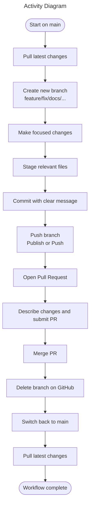
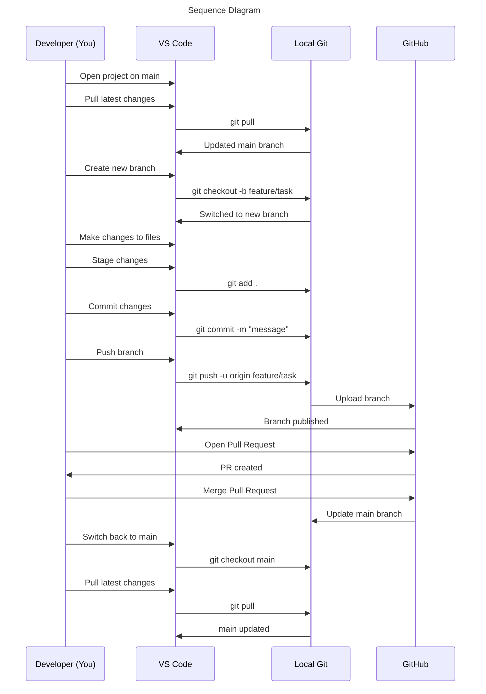
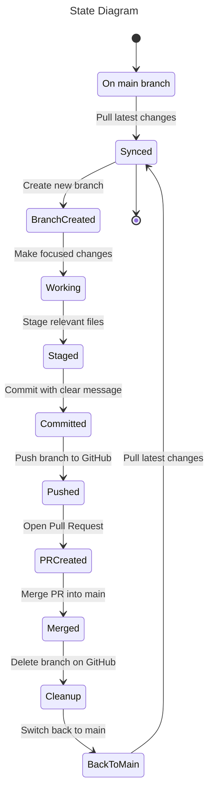
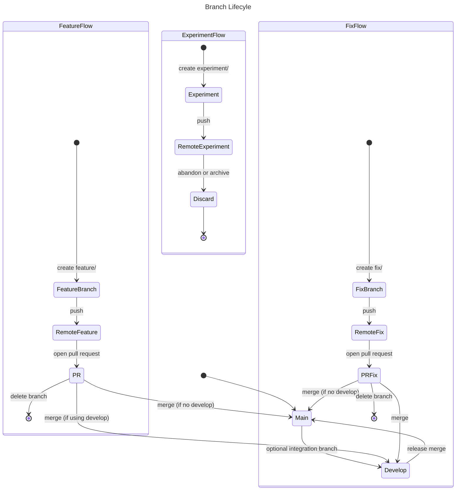

# GitHub README (ID: github-readme)
====
---
  

## §1. Creating a New GitHub Repository  

**[last section][3rd] &emsp; [next section][2nd]**
> --- 

1. Create the repo on GitHub  

>- Go to GitHub → New Repository
>- Name it (e.g., documentation-system)
>- Choose Public or Private

> Note: Do NOT initialize with README, .gitignore, or license  (This avoids merge conflicts when pushing an existing project.)

2. In your local project folder

>- Open a terminal inside the project root:

>> `git init`

>> `git add .`

>> `git commit -m "Initial commit"`


3. Connect your local repo to `GitHub` and Copy the repo URL from `GitHub (HTTPS or SSH)`:  

> `git remote add origin https://github.com/<username>/<repo>.git`


4. Push it

> `git branch -M main`

> `git push -u origin main`


That’s it — app is now live on GitHub.

**Note:** 
1. .gitignore file

> What the .gitignore actually does:

>- Folders that will NOT be uploaded: e.g.

>>- /dist
>>- /tmp
>>- /out-tsc
>>- /bazel-out
>>- /node_modules
>>- /.angular/cache
>>- .sass-cache/
>>- /coverage
>>- /typings
>>- __screenshots__/
>>- .idea/, .vscode/* (with exceptions), .history/*

>- Files that will NOT be uploaded:

>>- npm-debug.log
>>- yarn-error.log
>>- .DS_Store
>>- Thumbs.db
>>- libpeerconnection.log
>>- testem.log
>>- Various IDE/editor metadata files

>- Files that will be uploaded:

>> Anything not matched by the patterns above. For example:
>>- Your Angular source code (src/)
>>- Your documentation markdown files
>>- Your scripts
>>- Your configuration files (angular.json, package.json, etc.)
>>- Your README, ADRs, diagrams, onboarding docs

>- A Subtle Detail: The .vscode Exceptions
>> Your .gitignore says:

>>> Code

>>> .vscode/*

>>> !.vscode/settings.json

>>> !.vscode/tasks.json

>>> !.vscode/launch.json

>>> !.vscode/extensions.json

>>> Meaning:

>>> Everything in .vscode/ is ignored except those four files.

>> This is a common pattern for sharing workspace settings without leaking personal editor clutter.

> ***How to double-check locally:*** &emsp;`git status --ignored`

2. External Code Attribution

>1. Full Files

>> When an entire file originates from another author (with or without modifications), <u>include this header at the top of the file</u>:
```typescript
        /**
         * Original work by: &lt;Author Name>
         * Source: &lt;URL>
         * License: &lt;License Name>
         * Notes: &lt;Describe modifications or adaptation>
         */
```

>2. Functions or Snippets

>> When only a function or small block is reused, <u>place this comment directly above </u>>:

```typescript
        // Based on an implementation by &lt;Author Name> (&lt;License Name>)
        // Source: &lt;>URL>
```

>3. Conceptual Inspiration

>> When the idea came from external work but the implementation is original:

```typescript
        // Inspired by an approach from &lt;Author Name>
        // Source: &lt;URL>
```

>4. Centralized Credits (Optional)

>> If multiple external sources are used, they may also be listed in a Credits section:

```typescript

          /*
          ## Credits
           This project includes or adapts code from the following sources:

            - &lt;Author Name> - &lt;Project Name>  
            License: &lt;License Name>  
            Source: &lt;URL>

            - &lt;Author Name> - &lt;Project Name>;  
            License: &lt;License Name>  
            Source: &lt;URL>

            ...
          */

```

>5. License Preservation

>> When external code is included:

>>- Preserve the original author’s copyright notice
>>- Preserve the original license text (MIT, Apache, BSD, etc.)
>>- Do not remove or alter required notices
>>- Add a NOTICE file if the license requires it (e.g., Apache 2.0)

---

## §2. Daily Workflow

**[previous section][1st] &emsp; [next section][3rd]**
> ----

|Step |Action	                  |Purpose                   |
|:---:|:------------------------|:-------------------------|
|1	| Start on main	| Ensure local repo macthes GitHub:<br>&emsp; • Switch to main<br>&emsp; • Pull latest changes|
|2	| Create a task branch	| Isolate work and keep history clean:<br>&emsp; • Create new branch: `feature/..., fix/..., docs/...`<br>&emsp; • Publish the branch |
|3	| Make focused changes	| Avoid mixing unrelated changes:<br>&emsp; • Edit only files related to the task|
|4	| Commit cleanly 	| Maintain readable, reversible history:<br>&emsp; • Stage only relevant files<br>&emsp; • Commit using message format:<br>&emsp;&emsp; `type(scope): short description`|
|5	| Push the branch | Make your work visible on GitHub:<br>&emsp; • Publish branch (first push)<br>&emsp; • Push updates (later pushes)|
|6	| Open a Pull Request(PR)	| Review and integrate work into main:<br>&emsp; • Compare & pull request<br>&emsp; • Describe what changed and why<br>&emsp; • Merge when ready  |
|7	| Clean up	| Keep repo tidy and stay synced:<br>&emsp; • Delete branch on GitHub<br>&emsp; • Switch back to main<br>&emsp; • Pull latest changes|


1. Start on main and sync

>- Switch to the main branch in VS Code
>- Pull the latest changes (or click Sync Changes)
>- Confirm the working directory is clean

> ***Purpose: ensures ther local environment matches the remote repository. before starting new work***

2. Create a new branch for a task

>- Click the branch name in the bottom-left of VS Code
>- Select Create new branch
>- Use a descriptive name(examples):

>>- feature/scroll-restoration
>>- fix/markdown-renderer
>>- docs/adr-print-mode

> VS Code switches to the new branch automatically

> ***Purpose: isolates each task, keeps the history clean, and makes PRs easy to review.***

3. Make focused changes

>- Edit files normally
>- Avoid mixing unrelated changes in the same branch

> ***Purpose: akeeps commits meaningful and PRs easy to understand.***

4. Commit changes

>- Open the Source Control panel:
>- Stage only the files (click the + next to each file or next to Changes)
>- Write a clear commit message, and typcal message format:

>> __`type(scope): short description`__

>> __Examples:__
>>- `feat(scroll): implement scroll restoration`
>>- `fix(renderer): resolve KaTeX wrapping issue`
>>- `docs(adr): add print-mode architecture ADR`

>- Click ✔ Commit

> ***Purpose: creates a readable, reversible history that future contributors can follow.***

5. Push branch

>- Click Publish Branch (for new branches), or Click the ↑ Push icon

> ***Purpose: uploads the branch to `GitHub` so it becomes visible for review.***

6. Verify branch on `GitHub`

>- On `GitHub`:

>>- Open the repository
>>- Go to the Branches tab
>>- Confirm the branch appears alongside main

>- `GitHub` will show:

>>- “Compare & pull request”

> ***Purpose: ensures the branch exists remotely and is ready for a PR.***

7. Open a Pull Request (PR)

>- Click Compare & pull request
>- Write a clear description of what changed and why
>- Add screenshots or diagrams if helpful
>- Submit the PR
>- Merge when ready

> ***Purpose: documents the change , enables review, and integrates the work into main.***

8. Delete the branch after merging

>- On GitHub:

>>- Click Delete branch after merge

>- In VS Code:

>>- Switch back to main
>>- Pull the latest changes

> ***Purpose: keeps the repository tidy and ensures the local environment stayes with the remote.***

> ---


> ---



> ---


----
## §3. Git Branching Policy 

**[previous section][2nd] &emsp; [first section][1st]**
> ----

> This repository follows a lightweight, contributor‑friendly branching strategy designed to keep development fast, isolated, and easy to review. All work happens in short‑lived branches, and every change enters the codebase through a pull request.

1. Main Branches

> main:

>- Always stable and deployable
>- POnly updated through pull requests
>- Represents the latest production‑ready state

> develop (optional; use only if multiple contributors work in parallel):

>- Integration branch for upcoming releases
>- Features merge here before being promoted to main
>- CI runs full test suite on every merge

> If the project is small or you prefer simplicity, skip develop and merge feature branches directly into main.

2. Working Branches

> If the project is small or you prefer simplicity, skip develop and merge feature branches directly into main.

> Branch types:

| Type	| Naming Convention	| Purpose |
|:------------|:-----------------|:-----------------|
| Feature	| feature/ | New functionality or enhancements |
| Fix	| fix/ | Bug fixes or patches |
| Refactor | refactor/ | Structural or code‑quality improvements |
| Experiment(*1) | experiment/ | Spikes, prototypes, or exploratory work |

>> Note *1: Experimental Work such as prototypes or uncertain ideas:
>>- Use experiment/<idea>
>>- Push if you want to share or back up your work
>>- Merge only if the experiment becomes a real feature
>>- Otherwise, delete the branch when done

>> ***This keeps the main history clean while supporting exploration.***

> Rules for Working Branches:

>- Keep branches focused and scoped
>- Commit as often as needed
>- Push freely (CI will validate your work)
>- Open a pull request when the work is complete
>- Delete the branch after merge

3. Pull Request Workflow

>1. Create a branch from main (or develop)
>2. Commit and push your changes
>3. Open a pull request
>4. Provide a clear summary, motivation, and testing notes
>5. Request review if needed
>6. Squash merge to keep history clean
>7. Delete the branch after merge

> Note: ***Pull requests should be small, focused, and easy to review. Large changes should be split into multiple branches.***

> ----




## §4. Creating a New GitHub Repository from an existing one, with its project changed  

You can create a new repository from an existing project with a new project name by following a clean, reliable workflow. The key is to rename the project folder, reset its Git history, and push it as a fresh repo.

The short version:
 Rename → Remove old Git history → Re‑init → Create new remote → Push.

Below is the full, structured guide you can follow on Windows 11 Pro.

🔧 Core Steps (Renaming + New Repository)
1. Rename your project folder

If your existing project is in old-project/, rename it:

old-project → new-project


This changes only the folder name, not the code.

2. Remove the old Git history

Inside the renamed folder:

cd new-project
rm -rf .git


This wipes the old repository metadata so you can start fresh.

3. Initialize a new Git repository
git init
git add .
git commit -m "Initial commit for renamed project"


Now your renamed project is a brand‑new repo locally.

4. Create a new remote repository

Create a new repo on GitHub, GitLab, Azure DevOps, etc.
 Let’s say the new remote URL is:

https://github.com/yourname/new-project.git


Add it:

git remote add origin https://github.com/yourname/new-project.git

5. Push the new repository
git branch -M main
git push -u origin main


You now have a new repository, with a new project name, containing the existing code, but without the old history.

🧭 Alternative Paths (Depending on your goal)
Keep old history — rename the folder and push to a new remote without deleting .git.
Split only part of the repo — use git subtree or git filter-repo.
Duplicate the repo with full history — clone → rename → change remote.
🗂️ Quick Comparison Table
Goal	Best Method	Key CommandNew repo, no history	Delete .git	rm -rf .git
New repo, keep history	Change remote	git remote set-url origin ...
Extract part of repo	Subtree split	git subtree split
Full duplicate	Clone + new remote	git remote add origin ...
Next Step for You

Since you asked about “creating a new repository for the existing one, with its project name changed,” the workflow above is the correct one.

If you want, I can generate a step‑by‑step command script tailored to your actual folder names.
 Which direction do you want to take next:

new repo without history
new repo keeping history
duplicate repo including branches


## §5. duplicate your existing repository, rename the project, and publish it as a new repo  

You want to duplicate your existing repository, rename the project, and publish it as a new repo — while keeping the full Git history.
 That’s a very common workflow, and the cleanest way is to clone → rename → point to a new remote → push.

The concise answer:
 Clone the repo → rename the folder → change the remote → push as a new repository.

Below is the complete, structured guide.

✅ Exact Workflow: Copy Existing Repo → Rename Project → Create New Repo (History Preserved)
1. Clone your existing repository

This gives you a full copy including all branches and history.

git clone https://github.com/yourname/old-project.git


This creates:

old-project/

2. Rename the project folder

Just rename the directory:

old-project → new-project


This changes the project name without touching the Git history.

3. Enter the renamed folder
cd new-project

4. Remove the old remote origin

You want this copy to point to a new repository.

git remote remove origin

5. Create a new empty repository on GitHub/GitLab/etc.

Example new repo:

https://github.com/yourname/new-project.git

6. Add the new remote
git remote add origin https://github.com/yourname/new-project.git

7. Push everything to the new repository
git push -u origin --all
git push -u origin --tags


This pushes:

all branches
all tags
full history

Your new repository is now a complete copy of the old one, but with a new project name.

🧭 Alternative paths depending on your intent
Copy repo but remove history — delete .git and re-init.
Copy only part of the repo — use git subtree or git filter-repo.
Rename project inside the same repo — no new repo needed.
🗂️ Quick Comparison Table
Goal	Method	Keeps History?	CommandsDuplicate repo with new name	Clone → rename → new remote	Yes	git clone, git remote remove, git remote add
New repo without history	Delete .git	No	rm -rf .git
Split part of repo	Subtree	Yes (partial)	git subtree split
Want me to generate the exact commands for your actual repo names?

### Example01
Short answer:
 If you clone project01 inside the same folder where project01 already exists, you will simply get a second copy of the repository, usually named:

project01 (existing)
project01 (new clone) → project01-1 or project01 (1)


Git does not overwrite the existing folder. It creates a new folder with a slightly modified name.

But let’s break down exactly what happens and how to do this cleanly.

🧩 What actually happens if you clone into the same parent folder?

Suppose your current structure is:

C:\work\
    project01\


If you run:

cd C:\work
git clone https://github.com/you/project01.git


Git will try to create:

C:\work\project01\


But since that folder already exists, Git will not overwrite it.
 Instead, it creates a new folder:

C:\work\project01 (1)\


or on Linux/macOS:

C:\work\project01-1\


Inside that new folder is a full copy of the repo, including history.

So you end up with:

project01/        ← your original working folder
project01-1/      ← new cloned copy


This is safe and normal.

🎯 If your goal is to create a new repository with a new project name

Then the correct workflow is:

1. Clone the existing repo into the same parent folder
git clone https://github.com/you/project01.git


This creates:

project01-1/

2. Rename the cloned folder
project01-1 → project02

3. Enter the renamed folder
cd project02

4. Remove the old remote
git remote remove origin

5. Create a new empty repo online (GitHub, GitLab, etc.)

Example new repo URL:

https://github.com/you/project02.git

6. Add the new remote
git remote add origin https://github.com/you/project02.git

7. Push everything (branches + tags)
git push -u origin --all
git push -u origin --tags


Now you have:

project01 → original repo
project02 → new repo, same history, new name
🧭 If you want to explore alternatives
duplicate with history
duplicate without history
rename inside same repo

#### ERROR Happens; 
**Message: PS C:\Users\mnskk\Development\Angular21\documentation> git clone https://github.com/kn-mnsk/ulde-model-01.git
fatal: destination path 'ulde-model-01' already exists and is not an empty directory.**

Your error is happening because Git refuses to clone into a folder that already exists — and your folder:

C:\Users\mnskk\Development\Angular21\documentation\ulde-model-01


already exists and is not empty.

So Git stops with:

fatal: destination path 'ulde-model-01' already exists and is not an empty directory.


Let me show you the three correct ways to clone your repo when the folder already exists — and which one fits your ULDE workflow.

🎯 Option 1 — Clone into a new folder name (recommended)

This is the cleanest way to duplicate your repo.

git clone https://github.com/kn-mnsk/ulde-model-01.git ulde-model-02


This creates:

documentation/
    ulde-model-01/   ← existing
    ulde-model-02/   ← new clone


Now you can rename the project inside Angular, change remote, etc.

🎯 Option 2 — Clone into a subfolder inside documentation

If you want to keep the naming pattern:

git clone https://github.com/kn-mnsk/ulde-model-01.git ulde-model-copy


Result:

documentation/
    ulde-model-01/
    ulde-model-copy/

🎯 Option 3 — Clone into an empty folder (only works if folder is empty)

If you manually create:

documentation\ulde-model-02\


and it is empty, then:

git clone https://github.com/kn-mnsk/ulde-model-01.git ulde-model-02


works fine.

But your folder ulde-model-01 is not empty, so Git refuses.

🧠 Why Git refuses to clone into an existing folder

Git must create:

destination/.git/


If the folder already contains files, Git cannot guarantee a clean repo, so it aborts.

🧭 What you actually want (based on ULDE workflow)

You want:

a copy of ulde-model-01
with a new project name
with full Git history
inside the same documentation folder

So the correct command is:

git clone https://github.com/kn-mnsk/ulde-model-01.git ulde-model-02


Then:

cd ulde-model-02
git remote remove origin
git remote add origin https://github.com/kn-mnsk/ulde-model-02.git
git push -u origin --all
git push -u origin --tags

### Example02 -  duplicate repo with history
You’ve got it — here is the exact, correct, safest workflow to duplicate an existing Git repository with full history, give it a new project name, and push it as a new remote repo.
 This is the method used by professionals because it preserves:

all commits
all branches
all tags
full history

…and keeps your original repo untouched.

✅ Full Workflow: Duplicate Repo With History (Copy → Rename → New Remote → Push)
1. Go to the parent folder

Your structure is:

C:\Users\mnskk\Development\Angular21\documentation\


So:

cd C:\Users\mnskk\Development\Angular21\documentation

2. Clone the existing repo into a NEW folder name

Your error happened because you tried cloning into a folder that already exists.

So choose a new folder name:

git clone https://github.com/kn-mnsk/ulde-model-01.git ulde-model-02


This creates:

documentation/
    ulde-model-01/   ← original
    ulde-model-02/   ← full duplicate (with history)

3. Enter the new folder
cd ulde-model-02

4. Remove the old remote origin

You don’t want this duplicate to push back into the original repo.

git remote remove origin

5. Create a new empty repo on GitHub

Example:

https://github.com/kn-mnsk/ulde-model-02.git

6. Add the new remote
git remote add origin https://github.com/kn-mnsk/ulde-model-02.git

7. Push everything (branches + tags + history)
git push -u origin --all
git push -u origin --tags


Now your new repo is a complete duplicate of the original, including:

full commit history
all branches
all tags
all files

But with a new project name and a new remote.

📌 Result

You now have:

ulde-model-01  → original repo
ulde-model-02  → duplicated repo with full history


Both independent, both clean.


### Example03 - duplicate repo without history
You want to duplicate your existing repo but start fresh — no commits, no branches, no tags, no history.
 This is the cleanest workflow: copy the files → delete .git → re‑init → push to a new remote.

The short version:
 Copy folder → remove .git → git init → new remote → push.

✅ Exact Workflow: Duplicate Repo Without History
1. Go to your parent folder

Your structure:

C:\Users\mnskk\Development\Angular21\documentation\


So:

cd C:\Users\mnskk\Development\Angular21\documentation

2. Copy the existing project folder

Make a new folder for the fresh repo:

Copy-Item -Recurse ulde-model-01 ulde-model-02


Now you have:

ulde-model-01/   ← original repo (with history)
ulde-model-02/   ← new copy (still contains .git)

3. Remove the old Git history

Inside the new folder:

cd ulde-model-02
Remove-Item -Recurse -Force .git


Now ulde-model-02 is just files, no Git history.

4. Initialize a new repository
git init
git add .
git commit -m "Initial commit for ulde-model-02"


This creates a brand‑new repo with a single initial commit.

5. Create a new empty GitHub repository

Example:

https://github.com/kn-mnsk/ulde-model-02.git

6. Add the new remote
git remote add origin https://github.com/kn-mnsk/ulde-model-02.git

7. Push the new repository
git branch -M main
git push -u origin main

📌 Result

You now have:

ulde-model-01  → original repo (full history)
ulde-model-02  → new repo (no history, clean start)


Both independent, both clean.

🧭 Related workflows
duplicate with history
rename inside same repo
extract subfolder into new repo

## §6. create a new repository at github by git command in local terminal 

You can create a brand‑new GitHub repository directly from your local terminal, but there is one important truth:

Git itself cannot create a GitHub repository.
 GitHub CLI (gh) can.

So the correct way is:

Install GitHub CLI (gh)
Authenticate once
Run gh repo create from your project folder

This is the official, clean, professional workflow.

⭐ Fast Answer: Create a New GitHub Repo from Local Terminal
1. Install GitHub CLI (if not installed)

Windows 11:

winget install GitHub.cli

2. Log in to GitHub from terminal
gh auth login


Choose:

GitHub.com
HTTPS
Yes to browser login
3. Go to your project folder

Example:

cd C:\Users\mnskk\Development\Angular21\documentation\ulde-model-02

4. Create a new GitHub repository from this folder
gh repo create kn-mnsk/ulde-model-02 --public --source=. --push


This command:

creates a new repo on GitHub
links your local folder to it
pushes your code automatically
🎯 If you want more control (manual push)
Create the repo on GitHub without pushing
gh repo create kn-mnsk/ulde-model-02 --public --source=. --remote=origin


Then push manually:

git add .
git commit -m "Initial commit"
git push -u origin main

### Example01

__procedure of a new project generation by cloning a existing github repo:
Assuming:
existing git repo: https://github.com/myname/current-project.git
local folder: c: /local/development
current-project lives in c: /local/development__

✅ Create a New Project by Cloning an Existing GitHub Repo (No History)

Assumptions:

Existing repo:
 https://github.com/myname/current-project.git
Local folder:
 C:\local\development
Existing project already lives in:
 C:\local\development\current-project

Your goal:
 ➡️ Create a new project (new-project) based on the existing one, but with NO Git history.

✅ Step‑by‑Step Procedure
1. Clone the existing GitHub repo into a NEW folder

Your version was correct:

cd C:\local\development
git clone https://github.com/myname/current-project.git new-project


This creates:

current-project/
new-project/


✔️ Good
 ❗ But do NOT run Remove-Item from the parent folder — that was the mistake.

2. Remove the old Git history (inside the new project)

cd C:\local\development\new-project
Remove-Item -Recurse -Force .git


Now new-project is just files, no Git history.

3. Initialize a new repository


git init
git add .
git commit -m "Initial commit for new-project"


This creates a fresh repo with a single commit.

4. Create a new empty GitHub repository (using GitHub CLI)

cd C:\local\development
git clone https://github.com/myname/current-project.git new-project

cd new-project
Remove-Item -Recurse -Force .git

git init
git add .
git commit -m "Initial commit for new-project"

gh repo create myname/new-project --public --source=. --remote=origin
git push -u origin main

📌 Summary of Fixes
You must delete .git inside new-project, not in the parent folder.
You don’t need a second git add / git commit.
gh repo create should be run inside the new project folder.
Push only once after creating the remote.
🔗 Want the version that keeps history instead?

### Example02 - duplicate repo with history

The cleanest, safest, Git‑correct way to duplicate a repo with full history is exactly what you’re already trying to do, Masaaki — and I’ll give you the precise, corrected, ready‑to‑paste workflow tailored to your Windows 11 Pro environment and your folder structure.

The core idea is simple:
 Clone → rename → remove old remote → add new remote → push everything.

This preserves all commits, all branches, all tags, and all history.

⭐ Exact Procedure: Duplicate a Repo With Full History
🥇 1. Go to your parent folder

You keep your projects under:

C:\Users\mnskk\Development\Angular21\documentation\


So:

cd C:\Users\mnskk\Development\Angular21\documentation

🥇 2. Clone the existing repo into a NEW folder name

This is the key step.
 You must clone into a new folder, not the existing one.

git clone https://github.com/myname/current-project.git new-project


This creates:

current-project/   ← original
new-project/       ← full duplicate (with history)


✔ Git history preserved
 ✔ All branches included
 ✔ All tags included

🥇 3. Enter the new project
cd new-project

🥇 4. Remove the old remote origin

You don’t want your duplicate pushing back into the original repo.

git remote remove origin


Now the repo has no remote.

🥇 5. Create a new empty GitHub repository

Using GitHub CLI (gh):

gh repo create myname/new-project --public --source=. --remote=origin


This command:

creates a new GitHub repo

sets origin to that new repo

does not push automatically

🥇 6. Push all branches + tags + history

git push -u origin --all

git push -u origin --tags


This sends:

all branches

all tags

full commit history

to your new GitHub repo.

🎉 Result

You now have:

current-project   → original repo (full history)

new-project       → duplicated repo (full history)


Both independent, both clean.

📌 Your procedure vs. the correct one

Here’s the corrected version of your steps:

Your Step	Issue	Correct StepClone repo	✔ correct	✔ correct
Remove .git	❌ wrong (removes history)	❌ do NOT remove .git
git init	❌ wrong	❌ not needed
Create new repo	✔ correct	✔ correct
Push	✔ correct	✔ correct

To duplicate with history, you must NOT delete .git.

Deleting .git is only for duplicate without history.

🧭 Want the version that duplicates without history?

Use this:
 duplicate without history

Or if you want to rename inside the same repo:
 rename inside same repo

### Example03 - a perfect script that duplicates ulde-model-01 into ulde-model-03 with full history

Here is the exact, clean, safe, fully‑correct PowerShell script that will duplicate your existing repo ulde-model-01 into a new repo ulde-model-03, with full Git history preserved.

This script assumes your working folder:

C:\Users\mnskk\Development\Angular21\documentation


and your GitHub username:

kn-mnsk

✅ Perfect PowerShell Script — Duplicate ulde-model-01 → ulde-model-03 (Full History)
#### Go to your documentation folder
cd C:\Users\mnskk\Development\Angular21\documentation

#### Clone the existing repository into a new folder
git clone https://github.com/kn-mnsk/ulde-model-01.git ulde-model-03

#### Enter the new project folder
cd ulde-model-03

#### Remove the old remote so this clone does not push to the original repo
git remote remove origin

#### Create a new GitHub repository and set it as the remote origin
gh repo create kn-mnsk/ulde-model-03 --public --source=. --remote=origin

#### Push all branches and tags (full history) to the new GitHub repository
git push -u origin --all
git push -u origin --tags

📌 What this script does
Clones ulde-model-01 → ulde-model-03
Keeps full history (all commits, branches, tags)
Removes old remote (so you don’t accidentally push to ulde-model-01)
Creates a new GitHub repo named ulde-model-03
Pushes everything to the new repo

This is the professional, correct, safe method for duplicating a repo with full history.

🧭 If you want the version that duplicates without history

Use this guided link:

duplicate without history

If you want to rename inside the same repo:

rename inside same repo

## §7. merge a branch to master
You merge branchA → master on GitHub by creating a pull request and then merging it.
 The essential idea: GitHub never merges branches directly — it merges pull requests.
 This is the official method.
✅ Fast answer: How to merge branchA into master on GitHub
Push both master and branchA to GitHub.
On GitHub, open your repository.
Click Pull requests.
Click New pull request.
Set:
base = master
compare = branchA
Review the changes.
Click Merge pull request.
Choose merge method (merge commit / squash / rebase). 9. Confirm merge.

This merges branchA → master.

🧩 Why GitHub uses pull requests

GitHub merges branches through pull requests, not through direct branch-to-branch merge buttons.
 This allows:

code review
CI checks
conflict detection
protected branch rules
merge method selection (merge, squash, rebase)
🧭 If you want to merge using Git commands (local → push)

This is also valid and often faster:

git checkout master
git pull origin master
git merge branchA
git push origin master

This merges locally, then pushes to GitHub.
 This method is documented in multiple sources.
🗂️ Comparison Table
Method	Where	Best for	StepsGitHub pull request	GitHub UI	Collaboration, reviews, CI	PR → Merge
Local merge	Terminal	Fast, solo dev	git merge → push
Rebase then merge	Terminal	Clean history	git rebase → merge
🧠 Which method should YOU use, Masaaki?

Since you work with ULDE, Angular, and structured project versions, the GitHub pull request method is safest because:

it prevents accidental overwrites
it shows diffs clearly
it respects branch protection rules
it integrates with CI/CD
Want me to walk you through merging branchA → master in your actual ULDE repo?


## §8. manage two PCs, two branches

You’re in a very normal situation, Masaaki — two PCs, two branches, and one branch (lapTopB-branch) sitting on GitHub waiting to be merged into master.
 The good news: you can merge it cleanly right now from deskTopA, even though the branch was created on lapTopB.

Here’s the exact, correct way to merge branchA → master on GitHub.

✅ The GitHub‑correct way: merge via a pull request

GitHub always merges branches through pull requests, not direct branch merges.

Steps to merge lapTopB-branch into master on GitHub
Go to your repo on GitHub.
Click Pull requests.
Click New pull request.
Set:
base = master
compare = lapTopB-branch
GitHub will show the diff.
Click Merge pull request.
Confirm merge.

That’s it — lapTopB-branch is now merged into master.

🧠 Why your attempt on lapTopB failed

Common reasons:

You didn’t push the branch to GitHub.
GitHub couldn’t auto‑merge due to conflicts.
The base/compare were reversed.
The repo had branch protection rules.

But none of these block you now — the branch is already on GitHub, so deskTopA can merge it.

🥇 If you prefer merging locally on deskTopA

This is also valid and often faster.

Local merge method
git checkout master
git pull origin master
git merge lapTopB-branch
git push origin master


This merges locally, then pushes to GitHub.

Use this if you want to avoid GitHub’s UI.

🗂️ Which method should YOU use?

Given your ULDE workflow and two‑PC setup, the GitHub pull request method is safest because:

it prevents accidental overwrites
it shows diffs clearly
it works even if the branch was created on another PC
it respects branch protection rules
Want me to walk you through merging your actual branch step‑by‑step?


### Example

___Situation01: On my git hub repo, the tab 'pull rewuests' shows me the message 'last all commit from laspTopA', which i did yesterday, and can i use this to create a new pull request again___
Yes, Masaaki — you can absolutely create a new pull request again, even if GitHub shows “last commit from lapTopB” and even if your previous attempt failed.
 GitHub never “locks” a branch. As long as the branch still exists on GitHub, you can create a pull request at any time.

Let me explain clearly what you’re seeing and what you can do next.

⭐ What GitHub is showing you

When you open the Pull requests tab and see:

“last commit from lapTopB”

This simply means:

GitHub sees your branch (lapTopB-branch)
It sees the latest commit you pushed from lapTopB
It is waiting for you to create a pull request

This is normal and not an error.

GitHub is just showing the branch’s last activity.

⭐ Yes — you can create a new pull request again

As long as the branch exists, you can create a pull request anytime.

Steps:
Go to your repo on GitHub.
Click Pull requests.
Click New pull request.
Set:
base = master
compare = lapTopB-branch
GitHub will show the diff.
Click Merge pull request.

This merges lapTopB-branch → master.

⭐ Why your previous attempt failed

Typical reasons:

The branch wasn’t pushed yet.
You selected the wrong base/compare.
There were merge conflicts.
GitHub required a review (branch protection).
You were on the wrong repo or wrong fork.

But none of these block you now — the branch is already on GitHub, so you can merge it from deskTopA.

⭐ If GitHub does NOT show the “Compare & pull request” button

You can still create a PR manually:

Go to Pull requests.
Click New pull request.
Choose:
base: master
compare: lapTopB-branch

GitHub will always allow this as long as the branch exists.

⭐ If you prefer merging locally on deskTopA

You can merge the branch locally and push:

git checkout master
git pull origin master
git merge lapTopB-branch
git push origin master


This bypasses GitHub’s UI entirely.

___Situation02:  i pressed the button 'create new pull requests' or something, and I set compare:___

Got it, Masaaki — you pressed “Create new pull request”, set compare, and then… something went wrong before you finished.
 Let me walk you through exactly what happens at that moment, why it failed, and how to complete the merge cleanly right now.

⭐ What happens when you press “Create new pull request”

When you click New pull request, GitHub shows two dropdowns:

base → the branch you want to merge into
compare → the branch you want to merge from

In your case:

base = master
compare = lapTopB-branch

This is correct.

But you said:

“I pressed the button and set compare: …”

This means you reached the PR creation screen, but didn’t finish the merge.

⭐ Why your pull request failed yesterday

There are only a few possible reasons:

1. You selected the wrong base/compare

If you accidentally set:

base = lapTopB-branch
compare = master

GitHub will say “Nothing to merge”.

2. The branch wasn’t pushed yet

If lapTopB didn’t push the branch, GitHub cannot create a PR.

3. Merge conflicts

GitHub will show a red message:

“This branch has conflicts that must be resolved.”

4. Branch protection rules

If master is protected, GitHub may require:

a review
CI checks
signed commits
5. You closed the PR without merging

Then the branch remains unmerged.

⭐ The important part:
Yes — you can create a new pull request again. Nothing is blocked.

GitHub allows you to create a PR any time as long as the branch exists.

⭐ How to finish the merge right now (from deskTopA)
1. Go to your repo on GitHub
2. Click Pull requests
3. Click New pull request
4. Set:
base = master
compare = lapTopB-branch
5. GitHub will show the diff
6. Click Merge pull request
7. Confirm merge

This merges lapTopB-branch → master.

⭐ If GitHub still refuses to merge

You can merge locally on deskTopA:

git checkout master
git pull origin master
git merge lapTopB-branch
git push origin master


This bypasses GitHub’s UI entirely.

⭐ Want me to walk you through the exact GitHub screen step‑by‑step?

I can guide you through:

which dropdown to click
what GitHub shows
how to confirm the merge
how to resolve conflicts if they appear

___Situation03: base:master <- compare:2026-08-28-Laptop, and says 'Able to merge'.
So the next step is to press the button 'View pluu request'?___

Excellent — that means your lapTopB branch is now fully merged into master, and your repo is back in a clean, unified state. Nice work, Masaaki.

Now that the merge is complete, here are the important follow‑up steps you may want to consider so both of your machines (deskTopA and lapTopB) stay perfectly in sync.

🎯 What you should do next on deskTopA

Since the merge happened on GitHub, your local master on deskTopA may still be outdated.

Run:

git checkout master
git pull origin master


This ensures deskTopA has the latest merged code.

🎯 What you should do next on lapTopB

Same idea — update your local master:

git checkout master
git pull origin master


If the branch 2026-08-28-Laptop is no longer needed, you can delete it locally:

git branch -d 2026-08-28-Laptop


And delete it on GitHub (optional):

git push origin --delete 2026-08-28-Laptop


This keeps your repo tidy.

🧠 Best practice for your two‑PC workflow

Since you switch between deskTopA and lapTopB, here’s the clean workflow to avoid conflicts:

Always pull master before starting work
Create a new branch for each session
Push the branch when done
Merge via GitHub
Pull master again on both machines

This keeps everything synchronized and avoids merge headaches.

If you want, I can help you set up a perfect ULDE workflow for two machines

For example:

naming conventions for branches
automatic cleanup
scripts to sync both PCs
how to avoid “diverged branch” issues
how to handle conflicts cleanly

